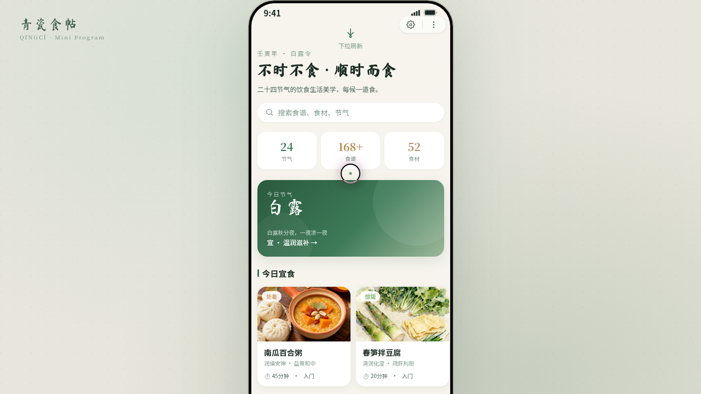

# 青瓷食帖 · 二十四节气饮食微信小程序

形态：微信小程序

> 日期：2026-08-17 ｜ 方向：V2 手机 UI ｜ 主题：二十四节气饮食生活美学 ｜ 领域：美食 / 文化艺术

## 简介

围绕二十四节气组织的饮食生活小程序：当令食帖首页、节气分类筛选、食谱详情、食札瀑布流、个人中心，7 个页面在统一手机外壳内可切换。青瓷水墨系（青瓷釉 #3D7A58 + 宣纸米白 + 墨青 + 古铜金），书法字体点缀节气名。本轮交替判定：上一轮最新为原生 App「绿社 Florapost」，故本次做微信小程序。

## 小程序交互

胶囊按钮自定义导航栏、页面栈 push/pop、底部 TabBar 选中弹跳、ActionSheet 半屏弹层、下拉刷新弹性回弹、左滑列表删除、吸顶 Tab 筛选、骨架屏加载、详情页吸底操作栏——共 9 种小程序端侧交互。

## 截图

## 动效亮点

页面级签名动效 ×2：首页入场序列动画、食谱详情 Hero 视差滚动。组件级 14+：自定义光标（弹簧跟随/悬停放大/点击涟漪）、手机 3D 倾斜、下拉弹性、ActionSheet 弹入、Tab 弹跳、环形进度、头像脉冲、骨架屏 shimmer、光泽扫过、spring-in 入场、滚动渐入揭示、打字机标题等。

## 文件说明

| 文件 | 说明 |
|---|---|
| `index.html` | 完整源码入口（JSX 全部内联）；实际预览走妙搭链接 |
| `设计规范.md` | 色彩系统（含色值）、字体、组件、小程序交互、动效、页面结构 |
| `preview.png` / `thumbnail.png` | 页面截图 |

## 在线预览

https://dcniaqwtmoca.feishu.cn/page/EFzJmSIdfdsJ04a3eELcQvBYn7f

## 技术栈

妙搭 html 应用（React JSX 内联于 index.html，Babel standalone 运行时编译）。
