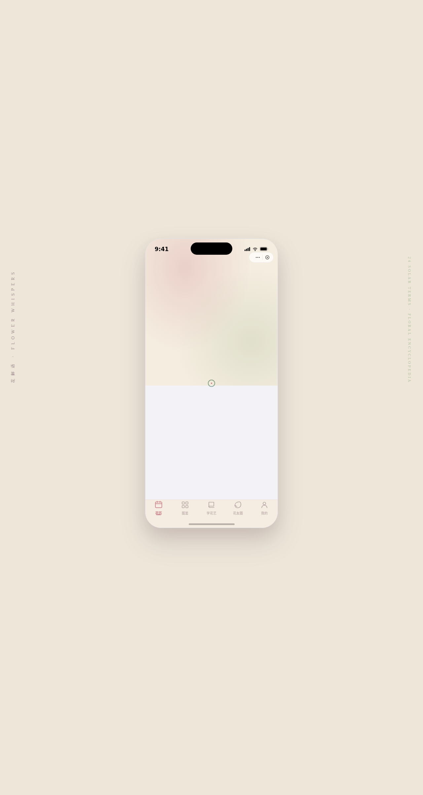

# 花解语 Flower Whispers · 节气花卉花艺小程序

> 日期：2026-08-17 · 方向：V2 手机 UI · 形态：微信小程序 · 主题：节气花卉百科与花艺教程

形态：微信小程序

## 简介

花解语是一个节气花卉百科与花艺教程微信小程序 mock。围绕二十四节气与对应花卉、花艺教程、花材图鉴、花友社区等内容组织，套在统一手机外壳内，包含 8 个页面。配色取自花卉自然色调——烟粉、鼠尾草绿、奶白、紫褐、柔金，每页有不同色彩主角。

## 截图展示

## 动效亮点

- 首页花卉绽放入场 + 落瓣环境动效
- 详情页 Hero 视差滚动
- 个人页环形进度动画
- 瀑布流错峰入场
- Tab 切换弹性过渡
- 下拉刷新弹性回弹
- 自定义光标（环形 + 中心点，hover/click 状态变化）

## 小程序交互语言

页面栈 push/pop 切换、底部 TabBar（选中态微动效）、半屏弹层/ActionSheet、下拉刷新弹性回弹、左滑列表操作、吸顶 Tab、底部安全区主按钮、骨架屏加载。

## 妙搭在线预览

https://dcniaqwtmoca.feishu.cn/page/Eer6mgv9QdNGioalWa9cNn5Knne

## 文件说明

| 文件 | 说明 |
|------|------|
| index.html | 完整源代码（React + Babel 内联） |
| components/ios-frame.jsx | iOS 手机外壳组件 |
| preview.png | 页面截图 |
| 设计规范.md | 设计规范文档 |

## 技术栈

React + Babel standalone（内联在 index.html 中），无外部 CDN 依赖。
