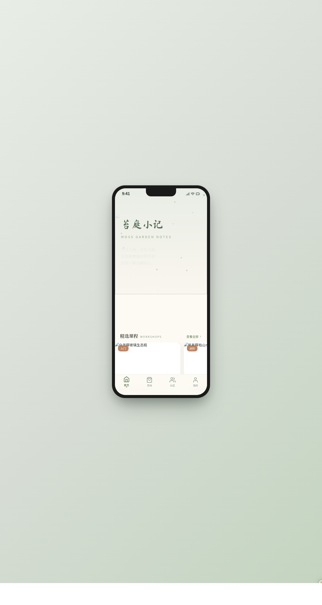

# 苔庭小记 · 苔藓微景观手作工坊小程序

> 日期：2026-08-17 · 方向：V2 手机 UI · 形态：微信小程序 · 主题：苔藓微景观手作工坊

形态：微信小程序

苔藓微景观（苔庭 / 生态瓶 / 造景）手作工坊与美学电商小程序。含首页推荐、工坊课程预约、苔材商城、作品社区、个人中心等 8 个页面，套在带胶囊按钮导航栏的统一手机外壳内。

## 截图

## 动效亮点

- 首页孢子飘散粒子 + 入场序列动画
- 详情页晨露滴落物理模拟 + 视差滚动
- 下拉弹性刷新（苔藓生长动效）
- 环形收藏进度 + 点赞弹跳 + Tab 弹性下划线
- 自定义光标弹簧跟随 + 涟漪

## 小程序端侧交互

页面栈 push/pop 右滑返回感、底部 TabBar（4 项 + 选中弹性）、下拉弹性刷新、底部 ActionSheet、吸顶筛选 Tab、详情页吸底操作栏、骨架屏。

## 在线预览

https://dcniaqwtmoca.feishu.cn/page/WtsRm8PQKdUeqUaMhRWclXpZnnb

## 文件说明

| 文件 | 说明 |
|------|------|
| index.html | 完整可运行源码（HTML + 内联 CSS + 内联 Babel JSX） |
| 设计规范.md | 色彩系统、字体、组件、动效、页面结构（含形态标记） |
| preview.png | 手机端截图（1280×2400） |

## 技术栈

React 18 + Babel standalone（全部内联），纯前端单文件，无外部 JSX/CSS 引用。
