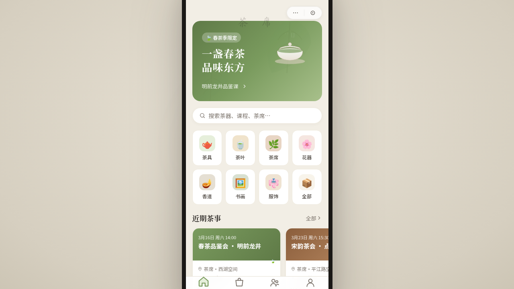

# 茶席 Chaxi · 茶文化微信小程序

> 日期：2026-08-17 · 方向：V2 手机 UI · 形态：微信小程序 · 主题：茶文化（茶器商城/茶艺课程/茶席预约/茶友社区）

形态：微信小程序

## 简介

统一手机外壳内的 8 页茶文化微信小程序：首页（茶席推荐+宫格分类+横向滚动）、茶器商城（吸顶 Tab+瀑布流双列）、商品详情（Hero 视差+吸底操作栏）、茶友社区（左滑操作卡片流）、个人中心（渐变头部+宫格+网格）、茶艺课程（筛选 Chip+横向图文列表），附设计规范页与 API 文档页。抹茶绿+陶土棕+瓷白+暗墨+鎏金配色，取自传统茶席器物色调。

## 妙搭在线预览

https://dcniaqwtmoca.feishu.cn/page/IKqvmbaGhduLWZaAOuwcnrTunJh

## 截图

## 端侧交互（8 种全部实现）

- 页面栈 push/pop 切换（右滑返回手势感）
- 底部 4 Tab TabBar（选中缩放+小圆点微动效）
- 半屏 ActionSheet（规格选择/胶囊菜单/举报等）
- 下拉刷新弹性回弹（首页）
- 左滑列表操作（社区帖子，举报/删除）
- 吸顶 Tab（商城分类+社区分类+接口文档）
- 底部吸底操作栏（详情页，安全区适配）
- 骨架屏加载（首页 loading 态）

## 动效亮点

- 签名动效 1：首页入场序列动画（各区块逐级 fade-up 错峰出现）
- 签名动效 2：详情页 Hero 视差滚动 + 吸顶标题渐现
- 蒸汽上升、茶叶浮动、Tab 选中弹跳、卡片按压缩放、Chip hover 上浮、点赞红心等 14 个组件级特效

## 文件说明

| 文件 | 说明 |
|------|------|
| index.html | 完整可运行的源代码（React JSX 内联，Babel 转译） |
| components/ios-frame.jsx | 手机外壳组件 |
| 设计规范.md | 色彩系统、字体、组件、动效、页面结构规范（含形态标记） |
| preview.png | 页面截图预览 |
| thumbnail.png | 缩略图 |

## 技术栈

React + JSX（内联在 script type="text/babel" 中），Babel standalone 转译。CSS 内联。自定义光标用 vanilla JS。支持 prefers-reduced-motion。
