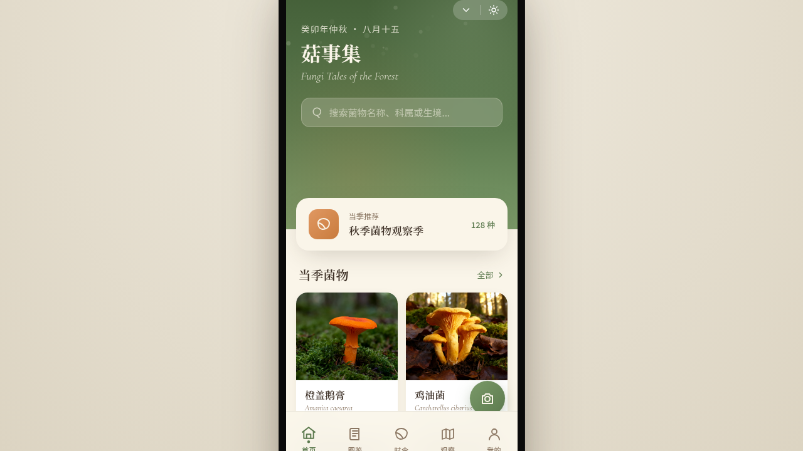

# 菇事集 Fungi Tales

> 日期：2026-08-17　方向：V2 手机 UI
> **形态：微信小程序**（与上一次「原生 App」交替）

## 简介

「菇事集」——一款野生菌观察与图鉴微信小程序。首页当季菌物卡片流、图鉴分类（按科属/可食性/生境/海拔/季节吸顶筛选）、菌物详情（形态特征/生境/相似种/毒性警示）、观察记录、个人中心，另含设计规范页与接口文档页共 8 页。内容采用真实菌物（橙盖鹅膏、鸡油菌、毒蝇伞、美味牛肝菌、羊肚菌、松茸），学名/生境/海拔/毒性严谨可信。

## 设计说明

- 配色：苔绿 `#5C7A4E` + 橙赭 `#C97B3D` + 奶油白 `#FAF5E9` + 深褐 `#3B2E24`，森林地表自然色系
- 小程序端侧交互 7 种：胶囊按钮/TabBar/页面栈右滑返回/半屏 ActionSheet/下拉刷新弹性/左滑列表/吸顶 Tab
- 详见 [`设计规范.md`](./设计规范.md)

## 动效亮点

孢子粒子飘散（Canvas）、菌菇破土弹性入场、苔绿渐变呼吸、环形进度双环填充、毒性警示脉冲、FAB 光晕、Hero 视差滚动等签名动效，全部符合菌物/森林主题语义。

## 截图

## 妙搭在线预览

https://dcniaqwtmoca.feishu.cn/page/VDEamFjs4d7HLham4wAciM3bnYc

## 文件说明

| 文件 | 说明 |
|---|---|
| index.html | 完整可运行源码（内联 JSX/CSS） |
| components/ | 组件源码目录 |
| thumbnail.png | 页面截图 |
| 设计规范.md | 色彩/字体/组件/动效/页面结构规范 |
| README.md | 本说明 |

## 技术栈

React + Babel standalone（内联于 index.html）、纯前端、无后端依赖
