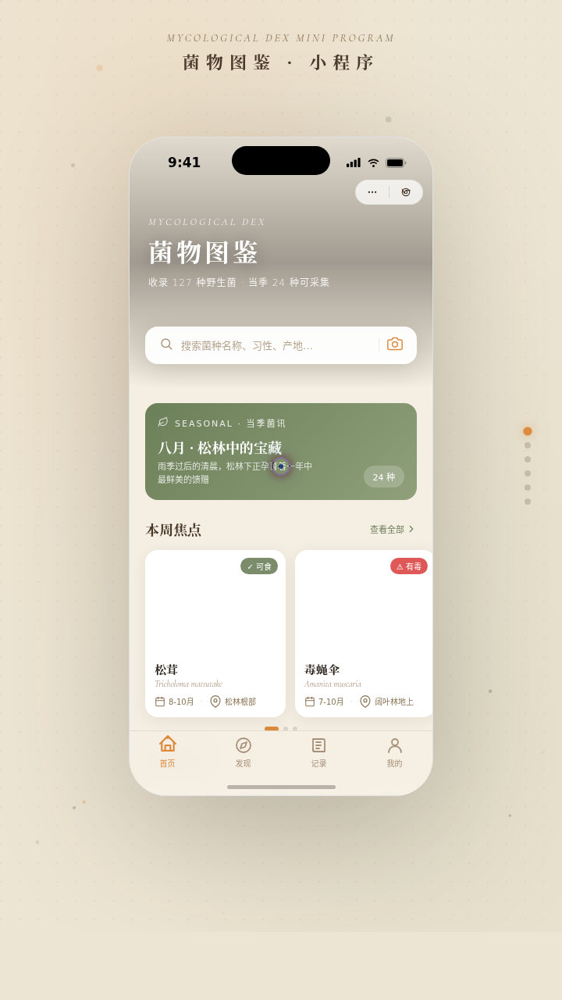

# 菌物图鉴 MycoDex

形态：微信小程序

- **日期**：2026-08-17
- **方向**：V2 手机小程序 UI
- **主题**：自然探索 · 菌物图鉴——野生菌观察采集微信小程序，浏览菌种、记录采集点、学习辨识与安全知识。
- **配色**：暖米白 `#F5EFE3` + 松露褐 `#4A382A` + 苔绿 `#6B7F59` + 孢子橙 `#DD8B3E` + 深墨褐 `#241C14`

## 简介
统一手机外壳 + 小程序容器内可切换 8 个页面的完整小程序 mock。小程序端侧形态：自定义导航栏、右上胶囊按钮、底部 TabBar（4 个）、页面栈 push/pop、下拉刷新弹性、左滑操作、半屏弹层、吸底操作栏。内容围绕真实菌种（鸡枞、牛肝菌、松茸、毒蝇伞、竹荪、羊肚菌、青头菌等）组织，无占位文字。

## 截图

## 动效亮点
首页入场序列动画、详情页 Hero 视差滚动、个人页环形图鉴进度描边、背景孢子飘散粒子；Tab 选中圆点弹跳、收藏心形变色缩放、分布点脉动、邮票徽章旋转倾斜、骨架屏 shimmer、筛选 chip 选中发光、胶囊按钮毛玻璃等 12+ 组件级特效。自定义光标（白环+孢子橙内点+多层发光，开页即居中，点击涟漪）。

## 在线预览
- 妙搭应用：https://dcniaqwtmoca.feishu.cn/page/J1Qjm3hVvdkPFZaCGOXcf7JCnUz

## 文件说明
| 文件 | 说明 |
|------|------|
| index.html | 完整可运行源码（JSX/CSS 全内联单文件） |
| 设计规范.md | 色彩系统、字体、8 页面结构、端侧交互、动效 |
| preview.png | 小程序界面截图 |

## 技术栈
React 18 + Babel standalone（全内联）、CSS3 动画、自定义光标系统、prefers-reduced-motion 降级。
