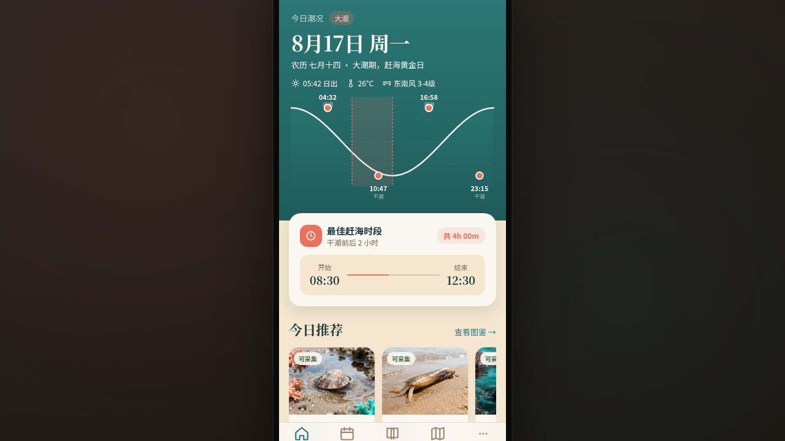

# 赶海手册 · Tidepool Handbook

形态：原生 App

> 日期：2026-08-17 · 方向：V2 手机 UI · 形态：原生 App（与上一次「微信小程序」交替） · 主题：赶海潮汐与海岸采集爱好者 App

## 简介

「赶海手册」是一个面向赶海爱好者的原生手机 App，提供潮汐查询、物种图鉴、采集点地图、收藏管理等功能。App 以海洋青+珊瑚+沙米的配色体系，营造出温暖的海岸氛围。8 个页面各有独特的布局语言——从潮汐曲线可视化到瀑布流图鉴，从半屏抽屉地图到左滑收藏列表，每个页面都有差异化的视觉层次。

## 截图

## 设计说明

- **配色**：沙米白（#f5e6d0）背景，海洋青（#2d7a7a）主色，珊瑚（#e8725c）强调，海藻绿（#4a6b4a）辅助
- **字体**：Noto Sans SC（正文）/ Noto Serif SC（标题）/ SF Mono（数据）
- **布局多样性**：8 页中至少 5 页有独特非重复布局（潮汐曲线/月历网格/瀑布流/全屏详情/地图抽屉）
- **页面色彩主角**：潮汐页偏海洋青、物种页偏珊瑚暖色、地图页偏沙米大地色

## 动效亮点

1. **首页入场序列** — 元素依次淡入上移
2. **潮汐曲线波浪** — SVG path 动画 + 填充渐变
3. **详情页视差滚动** — Hero 图层不同速率移动
4. **下拉弹簧刷新** — 首页下拉弹簧回弹
5. **TabBar 选中弹跳** — 选中图标弹跳缩放
6. **Large Title 收缩** — 滚动时大标题缩小为标准导航栏

## 原生交互语言（6+ 种）

Large Title 导航栏 / 底部 TabBar / 全屏详情页转场 / 模态弹窗 / 手势滑动切换 / 长按快捷菜单 / 下拉刷新 / 悬浮操作按钮 FAB

## 妙搭在线预览

https://dcniaqwtmoca.feishu.cn/page/SadFmHx5Od4pcMauQHAcLHINn1c

## 文件说明

| 文件 | 说明 |
|------|------|
| `index.html` | 完整可运行源代码（入口） |
| `components/ios-frame.jsx` | iOS 手机外壳组件 |
| `preview.png` | 页面截图 |
| `thumbnail.png` | 缩略图 |
| `设计规范.md` | 设计规范文档（含形态标记） |

## 技术栈

- React + Babel standalone（JSX 内联在 script 标签中）
- iOS 原生风格 UI 组件
- SVG（潮汐曲线/地图标记）
- CSS 动画 + RAF（动效系统）
