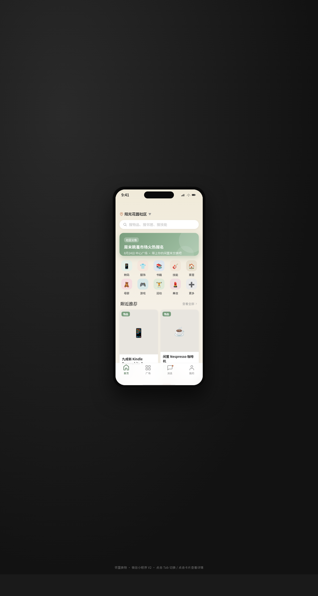

# 邻里换物 — Neighbor Barter

> 日期：2026-08-17 · 方向：V2 手机 UI · 形态：微信小程序 · 主题：社区邻里闲置物品交换与技能互换

## 简介

「邻里换物」是一个社区邻里闲置物品交换微信小程序。用户可以在社区内发布闲置物品、发布可交换的技能（修家电、教吉他等）、浏览邻居发布的物品、发起交换请求、查看交换记录。包含 8 个页面：首页瀑布流、广场吸顶筛选、物品详情视差、发布表单、消息骨架屏、个人中心宫格、设计规范页、接口文档页。

## 截图

## 动效亮点

- 卡片入场序列动画（依次淡入上浮，stagger delay）
- 下拉刷新弹性回弹（spring 物理模型）
- 详情页 Hero 视差滚动（图片随滚动缩放）
- 左滑列表操作阻尼滑动
- TabBar 选中态弹跳微动效
- 骨架屏加载闪烁

## 配色

鼠尾草绿 `#7a9e7e` + 暖米白 `#f5f0e6` + 陶土橙 `#c17a54` + 炭灰 `#2c2c2c` + 浅雾灰 `#e8e5df`

## 端侧交互

页面栈 push/pop、底部 TabBar（4项）、半屏 ActionSheet、下拉刷新弹性回弹、左滑列表操作、吸顶 Tab 筛选——共 6 种小程序端侧交互语言。

## 文件说明

| 文件 | 说明 |
|------|------|
| `index.html` | 完整可运行源码（React + Babel 内联单文件） |
| `preview.png` | 页面截图（1280×2400） |
| `设计规范.md` | 设计规范文档（含形态标记） |

## 妙搭在线预览

https://dcniaqwtmoca.feishu.cn/page/XlKLmEypRdMBBla8Xn9cKzB5n3d

## 技术栈

React（CDN Babel standalone）+ HTML + CSS，单文件 `index.html`
