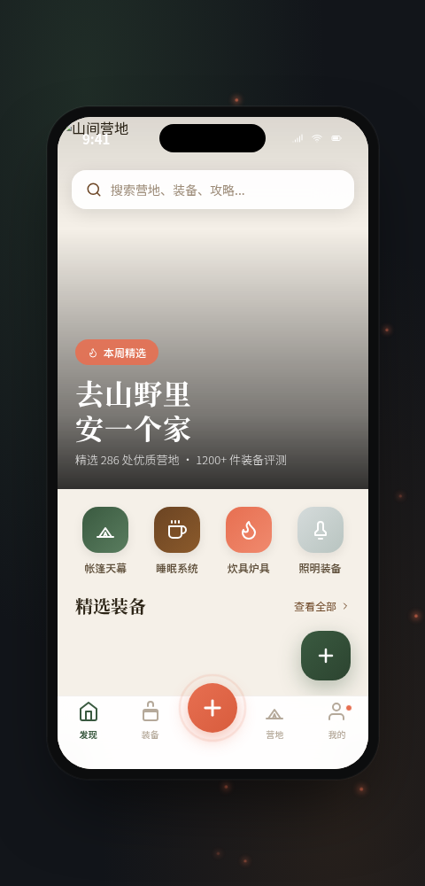

# 野宿 · 露营装备选物与营地社区

形态：原生 App

## 截图

## 简介

「野宿」是一款面向露营爱好者的原生手机应用，集**装备选物、营地预订、社区攻略**于一体。以山野为灵感，苔藓绿 + 篝火橙 + 树皮棕构成主色系，打造温暖有质感的户外生活美学体验。

## 页面构成

| 页面 | 路径 | 布局类型 | 核心交互 |
|------|------|----------|----------|
| 发现首页 | Tab「发现」 | Hero 大图 + 视差滚动 + 卡片堆叠 + 瀑布流 + 横向轮播 | 下拉刷新、Tab 切换 |
| 装备选物 | Tab「装备」 | 分类 Tab + 双列网格拼贴 | 分类切换、序列入场 |
| 发现营地 | Tab「营地」 | 地图顶图 + 筛选条 + 卡片列表 | 筛选标签、地图标点 |
| 个人中心 | Tab「我的」 | 渐变头部 + 毛玻璃数据卡 + 环形进度 + 菜单列表 | 数字计数、头像脉冲 |
| 详情页 | 点击营地/装备进入 | 全屏大图 + 圆角卡片上移 + 底部预订栏 | 返回栈、底部抽屉、涟漪 |
| 设计规范 | 我的 → 设计规范 | 色块网格 + 字体展示 + 组件样例 | 滚动浏览 |
| 接口文档 | 我的 → 接口文档 | TOC 横滑 + 接口卡片 + 代码块 | 分类切换 |

## 原生交互特性（≥4 种）

1. **底部 TabBar** — 原生质感毛玻璃，中间凸起悬浮发布按钮带脉冲光环
2. **返回栈导航** — 详情页左滑返回视觉，导航栏返回按钮
3. **底部半屏抽屉** — 分享面板从底部滑入，带半透明遮罩
4. **下拉刷新** — 帐篷拉绳隐喻，下拉距离影响旋转角度
5. **悬浮操作按钮 (FAB)** — 可展开的扇形菜单，带旋转过渡
6. **瀑布流 + 轮播画廊** — 营地瀑布流卡片、攻略横向轮播

## 组件级动效（12+）

1. 自定义光标（多层发光 + hover 放大 + 点击涟漪）
2. 背景萤火虫粒子漂浮
3. Hero 视差滚动
4. 入场序列动画（stagger fade-in）
5. 下拉弹性刷新（帐篷旋转）
6. 数字计数动画（个人中心数据）
7. 点赞粒子爆发
8. 按钮涟漪点击
9. 头像脉冲光环
10. 环形进度条
11. 发布按钮旋转 + 菜单弹性展开
12. 按钮光泽扫过动效
13. 滚动渐入（IntersectionObserver）
14. Tab 中心按钮脉冲
15. 地图标点弹跳

## 技术栈

- React 18 + Babel Standalone（浏览器内 JSX）
- 纯内联 CSS，零外部 CSS 依赖
- Google Fonts 自托管镜像（Noto Serif SC / Noto Sans SC）
- 全原生手写 SVG 图标
- 支持 `prefers-reduced-motion`
- 支持 `visibilitychange` 暂停动画

## 运行方式

直接用浏览器打开 `index.html` 即可。推荐在桌面端查看完整效果（含自定义光标与萤火虫背景）。

## 妙搭在线预览

https://dcniaqwtmoca.feishu.cn/page/Gxs9myjPodBUhsasfdNcAY9Entb

## 设计规范

详见 [设计规范.md](./设计规范.md)。

## 接口文档

App 内「我的 → 接口文档」页面可查看完整 API 参考。
