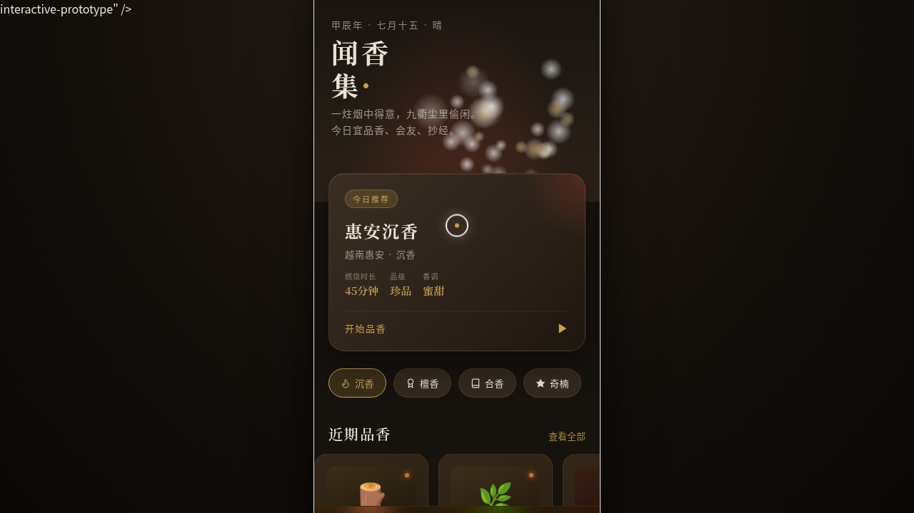

# 闻香集 Scentfolio · 香道品鉴 App

形态：原生 App（上一轮最新为微信小程序「菌物图鉴」，本轮交替为原生 App）

- **日期**：2026-08-17
- **方向**：V2 手机 UI
- **形态**：原生 App
- **主题**：香道爱好者的线香收藏与品香记录 App
- **配色**：烟熏乌木 `#2B2118` + 檀红 `#A63D2F` + 香灰白 `#E8E2D6` + 金箔 `#C9A24B` + 青竹 `#6B8E6E`

## 简介

统一 iOS 手机外壳内可切换 8 个页面的完整原生 App mock。内容围绕真实香道文化组织：惠安沉香、老山檀、星洲水沉、鹅梨帐中香、雪中春信等真实香品与香方，含藏香阁（收藏）、品香录（评分记录）、香会（线下活动）三大场景。原生交互语言覆盖底部 TabBar、返回栈导航、大标题导航栏、长按半屏抽屉、FAB、下拉刷新、模态 Toast 共 7 种。

## 动效亮点

- 首页青烟粒子签名动效：25+ 粒子袅袅升起，独立周期 / 相位 / 摆动
- 品香录香气雷达环签名动效：描边动画 + 数据多边形展开
- 余烬火星明灭、FAB 脉冲光环、香调进度条错峰入场
- 自定义光标（白环 + 金箔内点 + 多层发光，开页居中，悬停放大，点击涟漪）

## 妙搭在线预览

https://dcniaqwtmoca.feishu.cn/page/XeAWmBgDbdd2SZawvV0cXlSKnSc

## 文件说明

| 文件 | 说明 |
|------|------|
| `index.html` | 完整单文件源码（内联 JSX / CSS），可直接在浏览器打开预览 |
| `设计规范.md` | 色彩 / 字体 / 页面结构 / 动效系统 / 健壮性规范（含形态标记） |
| `preview.png` / `thumbnail.png` | 页面截图 |
| `README.md` | 本文件 |

## 技术栈

单文件 HTML + 内联 JSX（React via Babel standalone），Canvas 粒子，无外部图片依赖。
