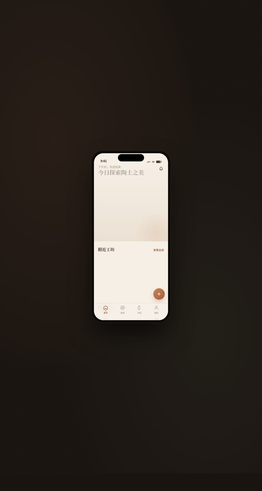

# 陶境 Tao Jing

> 日期：2026-08-17 · 方向：V2 手机 UI · 形态：原生 App · 主题：陶瓷艺术手作工坊

形态：原生 App

一个完整多页面的手机端原型，陶瓷艺术工坊主题，陶土橙 + 苔绿配色，8 页面含设计规范页与接口文档页，7 种原生交互模式。

## 动效亮点

- 首页入场序列动画（卡片错落渐入 + 上浮）
- 工坊详情页 Hero 大图视差滚动（签名动效）
- 我的页环形进度动画（签名动效，easeOut 计数）
- 下拉刷新弹性回弹 + 骨架屏 shimmer
- Tab 切换弹性缩放、FAB 旋转展开、长按快捷菜单回弹
- 自定义光标（居中初现 / hover 放大 / 点击涟漪 + difference 混合）

## 文件说明

| 文件 | 说明 |
|------|------|
| index.html | 完整可运行源码（JSX 内联，React via CDN） |
| 设计规范.md | 色彩 / 字体 / 交互模式 / 页面结构 / 动效 |
| preview.png | 页面截图 |
| thumbnail.png | 缩略图 |

## 妙搭在线预览

https://dcniaqwtmoca.feishu.cn/page/N0E9mapfidaDj8aGvOsckK4dnRb

## 技术栈

React 18（CDN）+ Babel standalone，所有 JSX 内联于 index.html `<script type="text/babel">`，CSS 内联。
