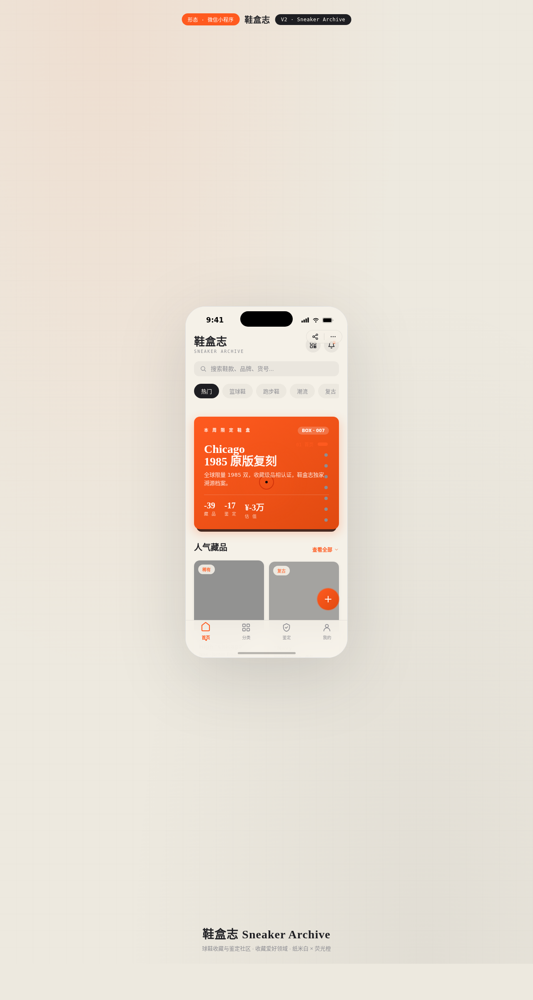

# 鞋盒志 Sneaker Archive

> 日期：2026-08-17 ｜ 方向：V2 手机 UI ｜ 形态：微信小程序 ｜ 主题：球鞋收藏与鉴定社区小程序

形态：微信小程序

## 简介

「鞋盒志」是一款球鞋收藏与 AI 鉴定社区小程序。纸米白 + 石墨黑为底，荧光橙为品牌色。统一手机外壳内可切换 8 个页面，覆盖鞋盒首页、分类瀑布流、详情吸底操作、个人中心环形等级、AI 鉴定上传、收藏左滑等小程序端侧交互。

## 动效亮点

- 首页 3D 鞋盒盖翻开（弹簧）
- 详情页图片视差滚动、个人中心环形进度动画
- 自定义光标：悬停放大 + 点击涟漪 + 光晕跟随
- 骨架屏闪烁、Shimmer 光泽扫过、Stagger 入场、头像脉冲、FAB 发光

## 妙搭在线预览

https://dcniaqwtmoca.feishu.cn/page/VQG4m9h5wddcSHa5cQKcFC9CnQc

## 文件说明

| 文件 | 说明 |
|------|------|
| index.html | 完整可运行源码（React + Babel 内联，含 8 页面） |
| components/ios-frame.jsx | 手机外壳组件源 |
| 设计规范.md | 色彩/字体/组件/动效/页面规范 |
| preview.png | 页面截图 |

## 技术栈

React 18 + Babel standalone（CDN），单 index.html，JSX 全部内联。
