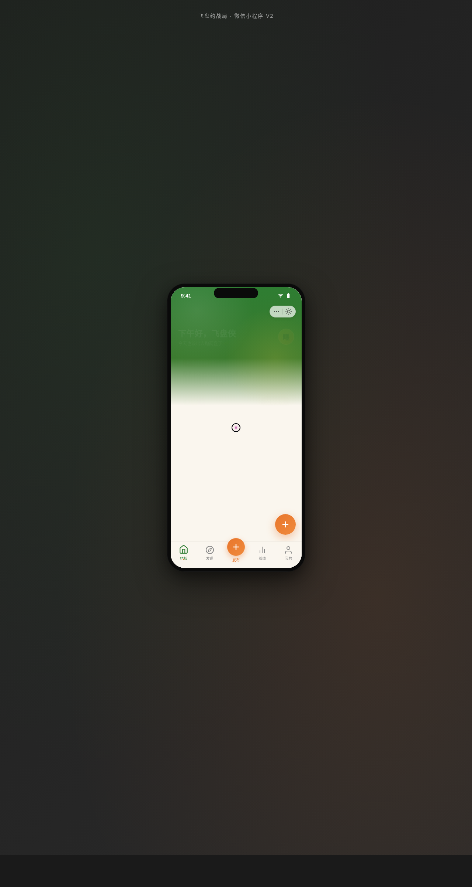

# 飞盘约战局 · 飞盘社群小程序

形态：微信小程序

> 日期：2026-08-17 · 方向：V2 手机 UI · 形态：微信小程序（与上一次「原生 App」交替） · 主题：飞盘社群约战记录

## 简介

一个飞盘爱好者约战、组局、记录战绩的微信小程序。围绕飞盘组织真实可信内容：约战局（地点 / 时间 / 人数 / 水平）、战队、战绩（得分 / 助攻 / 飞盘距离）、场地、装备、动态。整体套在统一手机外壳内，可在手机外壳内切换 8 个页面（页面栈 push/pop，右滑返回手势感）。

## 配色

草坪绿 `#2E7D32` + 落日橙 `#E8762C` + 奶白 `#FAF6EE` + 炭灰 `#2B2B2B` + 亮黄 `#FFD23F`。运动草坪风，绿橙撞色。禁止蓝紫渐变。

## 动效亮点

- 自定义光标：白环 + 草坪绿内点 + 多层发光，开页即现于屏幕中央
- 签名动效：首页飞盘旋转入场序列、个人页环形战绩进度填充
- 12+ 组件级特效：飞盘旋转、卡片浮入、下拉弹性、左滑揭示、Tab 下划线滑动、环形进度、数字计数、骨架屏微光、FAB 脉冲、视差滚动、Tab 弹跳、点击涟漪

## 小程序端侧交互

胶囊按钮导航栏、底部 TabBar（选中微弹跳）、ActionSheet 半屏弹层、下拉刷新弹性回弹、左滑列表删除、吸顶 Tab 下划线滑动、表单底部安全区主按钮——共 7 种。

## 截图

## 妙搭在线预览

https://dcniaqwtmoca.feishu.cn/page/J78UmUv3gdREqLa57NmcflbvnIC

## 文件说明

| 文件 | 说明 |
|---|---|
| index.html | 单文件完整源码（内联 CSS + JS，手机外壳内可切换 8 页面） |
| preview.png | 1280×2400 页面截图 |
| 设计规范.md | 色彩 / 字体 / 组件 / 动效 / 页面结构规范（含形态标记） |
| README.md | 本说明文件（含形态标记） |

## 技术栈

单 HTML 文件，内联 CSS + JavaScript（vanilla / 内联脚本），无外部 src 引用，无外部 CDN 依赖。
