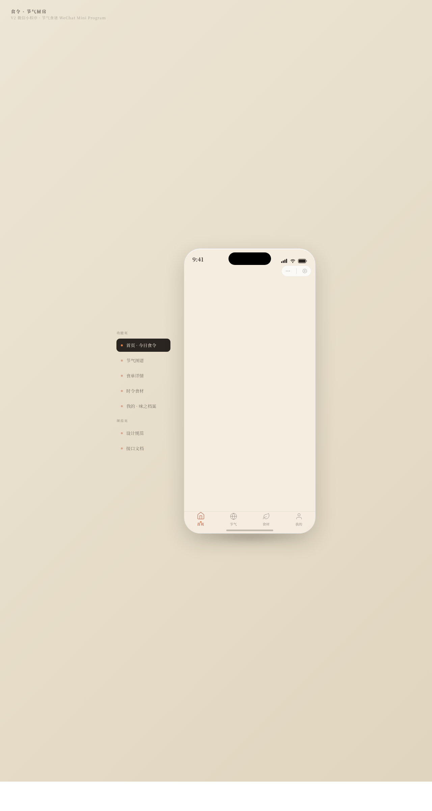

# 食令·节气厨房 (Seasonal Kitchen)

> 日期：2026-08-17 ｜ 方向：V2 手机 UI ｜ 形态：微信小程序 ｜ 主题：二十四节气食谱与食俗小程序

形态：微信小程序

## 简介

围绕二十四节气组织中式家常食谱、时令食材、节气食俗内容的微信小程序。整体套在带胶囊按钮的自定义导航栏 + 统一手机外壳内，含 7 个差异化布局页面。领域取自「美食·节气食谱」。

## 配色

陶土红 #B5482E 主色 + 米白 #F5EDE0 底 + 竹青绿 #6B8E4E 辅色 + 墨黑 #2A2520 文字 + 柿橙 #D97E4A 强调。中式厨房暖调 + 竹青凉辅。

## 截图

## 小程序端侧交互

底部 TabBar（选中弹跳）、页面 push/pop 切换、半屏分享 ActionSheet、吸顶筛选 Tab、详情页吸底操作栏、可展开手风琴——共 6 种小程序特有交互。

## 动效亮点

- 24 节气轮盘缓旋 + 中心反向旋转
- 蒸汽上升（首页/详情页主题语义动效）
- 三环进度环形填充、头像呼吸脉冲、卡片悬停发光跟随
- 自定义光标（白环 + 柿橙内点 + 点击涟漪）

## 文件说明

| 文件 | 说明 |
|------|------|
| index.html | 完整可运行源码（内联 JSX/Babel 单文件） |
| preview.png | 页面截图 |
| 设计规范.md | 色彩/字体/页面/动效规范（含形态标记） |

## 在线预览

https://dcniaqwtmoca.feishu.cn/page/ErqymGA6jdWuvsaStJpcirA8ngd

## 技术栈

HTML + 内联 CSS + 内联 JSX（Babel standalone），单文件。
