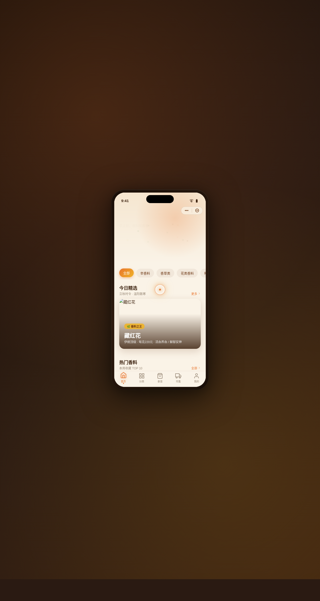

# 香料之路 · V2 手机 UI（微信小程序）

形态：微信小程序

> 日期：2026-08-17 · 方向：V2 手机 UI · 形态：微信小程序（上一次为原生 App，本次交替）· 主题：香料知识 / 图鉴 / 节气食谱 / 市集小程序（生活方式-美食领域）

## 简介

一个香料知识、图鉴、节气食谱与香料市集的微信小程序。围绕藏红花、肉桂、姜黄、豆蔻、丁香、孜然、八角等真实香料组织内容——首页精选卡片流、分类页吸顶筛选瀑布流、详情页风味环图与吸底操作栏、食谱页节气横滑、市集页深棕头图与左滑商品、个人中心环形等级。统一手机外壳内 8 页可切换。奶油白底配藏红花橙主色与姜黄强调，暖色香料调性。

## 形态

微信小程序：胶囊按钮自定义导航栏、底部 5 项 TabBar（选中弹跳）、半屏 ActionSheet、下拉刷新弹性回弹、左滑列表操作、吸顶 Tabs、吸底操作栏、骨架屏、页面栈 push/pop，共 9 种端侧交互语言。

## 截图

## 动效亮点

12+ 组件级动效：首页香料颗粒飘散入场、详情页 Hero 视差滚动、风味环图、数字计数、Tab 弹跳、按钮脉冲、涟漪点击、收藏心跳、骨架 shimmer、导航吸顶变色、页面栈切换过渡。自定义光标白环+橙点+多层发光，悬停变黄放大，点击涟漪。

## 妙搭在线预览

https://dcniaqwtmoca.feishu.cn/page/K8xDmirzodTWoLaIhRxcWyIQndd

## 文件说明

| 文件 | 说明 |
|------|------|
| index.html | 完整可运行源码（React + Babel 内联单文件） |
| preview.png | 页面截图（1280×2400） |
| thumbnail.png | 平台缩略图 |
| 设计规范.md | 色彩/字体/组件/动效/页面结构规范（含形态标记） |
| README.md | 本说明文件（含形态标记） |

## 技术栈

React + Babel standalone（JSX 全内联在 `<script type="text/babel">`，CSS 内联 `<style>`），单文件 index.html，无外部 src 引用。
