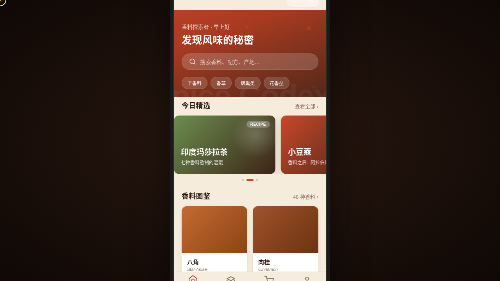

# 香料图鉴 Spice Codex · V2 手机 UI

> 日期：2026-08-17 ｜ 方向：V2 手机 UI ｜ 形态：微信小程序 ｜ 主题：香料百科与配方分享小程序

## 简介

「香料图鉴 Spice Codex」是一个香料百科与配方分享的微信小程序。8 个页面：首页香料卡片流、分类页吸顶筛选瀑布流、香料详情页气味金字塔+风味雷达、配方页半屏弹层步骤、市集页左滑操作、个人中心环形进度宫格，另含设计规范页与接口文档页。形态为微信小程序——自定义导航栏 + 胶囊按钮 + 页面栈 push/pop + 底部 TabBar + 半屏弹层 + 下拉刷新弹性。香料暖橙红配色。

## 形态

形态：微信小程序

## 截图

## 动效亮点

- 自定义光标：白环 + 姜黄内点 + 发光，悬停变形 + 点击涟漪
- 首页卡片错峰入场（签名动效）
- 详情页 Hero 视差滚动（直操 DOM）
- 下拉刷新研磨弹性（弹簧物理，签名动效）
- 个人中心 SVG 环形进度生长（签名动效）
- 香气粒子扩散 + 头像脉冲 + 骨架屏闪烁 + TabBar 选中微动效

## 端侧交互

页面栈 push/pop、底部 TabBar（4 项选中微动效）、半屏弹层、ActionSheet、下拉刷新弹性、左滑列表、吸顶 Tab、吸底安全区按钮、骨架屏。

## 文件说明

| 文件 | 说明 |
|------|------|
| index.html | 完整可运行源码（单文件，CSS/JS 内联） |
| 设计规范.md | 色彩系统、字体、组件、动效、页面结构（含形态标记） |
| preview.png / thumbnail.png | 页面截图 |
| README.md | 本说明文件（含形态标记） |

## 妙搭在线预览

https://dcniaqwtmoca.feishu.cn/page/Bgt1mSEnFd8aTbaQdLEcKyhOn0f

## 技术栈

纯 vanilla HTML/CSS/JS 单文件，无 React/Babel/外部 CDN 依赖。
