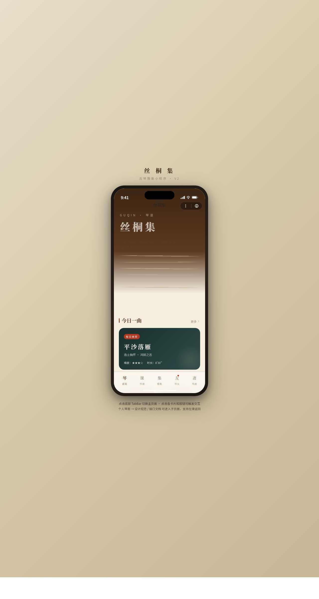

# 丝桐集 · 古琴雅集小程序

形态：微信小程序

> 日期：2026-08-18 · 方向：V2 手机 UI · 形态：微信小程序 · 主题：古琴学习与雅集预约小程序

## 简介

一个古琴学习与雅集预约的微信小程序高保真原型，在统一手机外壳内可切换 8 个页面（首页/琴课/雅集/琴谱/琴友社区/个人琴斋/设计规范/接口文档）。宣纸米白 + 紫檀深棕 + 黛青 + 朱砂的配色呼应东方文人语义，含琴弦振动、墨迹涟漪光标、环形练琴进度等签名动效。

V2 双形态交替：上一轮最新为原生 App（矿晶志），本次交替为微信小程序。

## 截图

## 动效亮点

- 琴弦振动（3 组不同相位）+ 徽位淡入 + 减字谱悬停展开
- 自定义墨迹涟漪光标（弹簧跟随 + 悬停放大 + 点击涟漪）
- 页面栈 push/pop 转场、底部 TabBar 选中弹跳、下拉刷新弹性、左滑列表操作、点赞心跳、视差滚动、环形进度动画（共 12+）

## 小程序端侧交互

胶囊按钮导航栏、页面栈 push/pop、底部 TabBar、半屏 ActionSheet、下拉刷新弹性、左滑列表、吸顶 Tab、骨架屏（≥4 种）。

## 妙搭在线预览

https://dcniaqwtmoca.feishu.cn/page/Q9DjmNolXdViIzaAyRucbarGn4f

## 文件说明

| 文件 | 说明 |
|---|---|
| index.html | 完整可运行源码（React 18 + Babel，JSX 内联） |
| components/ | 组件源码目录 |
| preview.png | 页面截图（1280×2400） |
| thumbnail.png | 平台缩略图 |
| 设计规范.md | 色彩/字体/动效/页面结构规范（含形态标记） |

## 技术栈

React 18 + Babel standalone（CDN 内联于 index.html），纯前端无后端。
