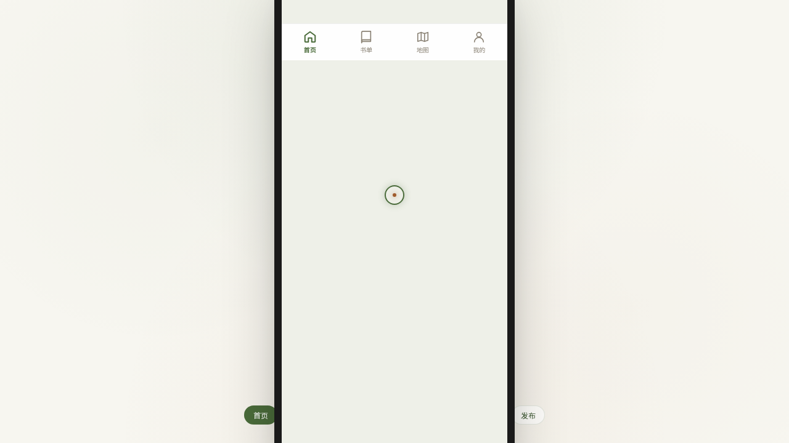

# 书渡 · 二手书漂流小程序

> 日期：2026-08-18 · 方向：V2 手机 UI · 形态：微信小程序 · 主题：二手书漂流微信小程序

## 简介

一个二手书漂流微信小程序的设计 mock，在统一手机外壳内可切换 8 个页面，涵盖首页卡片流、书单瀑布流、书籍详情、漂流地图、个人中心、设计规范、接口文档与发布漂流。端侧交互含胶囊导航、底部 TabBar、半屏弹层、下拉刷新、吸底操作栏等。

## 配色

苔绿 `#4a6b3a` · 月白 `#eef0e8` · 赭石 `#a05c2c` · 暖灰 `#8a8275`

## 动效亮点

- 自定义光标 + TabBar 弹跳
- 环形进度 / 下拉弹性回弹 / 漂流路径流动虚线
- Hero 视差 / 站点脉冲 / 骨架屏加载

## 文件说明

| 文件 | 说明 |
|---|---|
| index.html | 完整可运行源码（React CDN + 内联 JSX/Babel） |
| preview.png | 页面预览截图 |
| 设计规范.md | 色彩 / 字体 / 页面 / 动效规范 |

## 在线预览

https://dcniaqwtmoca.feishu.cn/page/F7GCmxWmjdZzRaaG829cCxOnnth

## 技术栈

React 18（CDN） + Babel standalone 内联 JSX，单文件，CSS 全内联。
