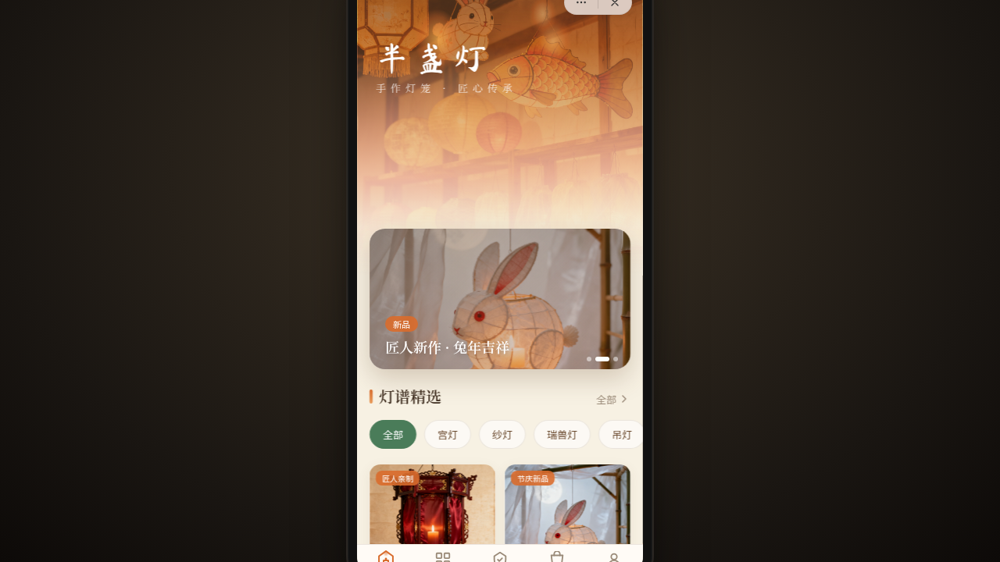

# 半盏灯 · V2 手机 UI（微信小程序）

**形态：微信小程序**

- 日期：2026-08-18
- 方向：V2 手机 UI（微信小程序形态）
- 主题：半盏灯 —— 手工灯笼铺小程序
- 配色：米纸白 + 竹青绿 + 柿橙 + 暖褐
- 交替判定：上一次（暗房日记）为「原生 App」，本次为「微信小程序」

## 简介

微信小程序形态的手工灯笼铺，呈现宫灯 / 纱灯 / 兔子灯 / 鲤鱼灯等传统手作灯笼的展示、定制与购买。8 个页面，含小程序胶囊按钮容器、底部 TabBar 点灯动效、下拉提灯刷新、左滑列表操作、吸底操作栏等端侧交互。

## 截图展示

## 动效亮点

- 灯火呼吸光晕 + 灯笼悬浮摆动
- 首页入场序列动画 / TabBar 选中点灯呼吸
- 下拉提灯弹性回弹刷新 / 左滑列表吸附操作
- 个人页环形积分描边入场 / 骨架屏 shimmer 等 12+ 特效

## 文件说明

| 文件 | 说明 |
|---|---|
| index.html | React 应用入口（JSX 内联于 babel script） |
| components/tweaks-panel.jsx | 调试面板组件 |
| preview.png | 页面截图 |
| 设计规范.md | 色彩 / 字体 / 组件 / 动效 / 页面结构规范（含形态标记） |

## 在线预览

https://dcniaqwtmoca.feishu.cn/page/LT6CmIX5FdftYaaus7qcxqk4nAd

## 技术栈

React + Babel standalone（JSX 内联），纯前端无后端，数据为前端模拟。
