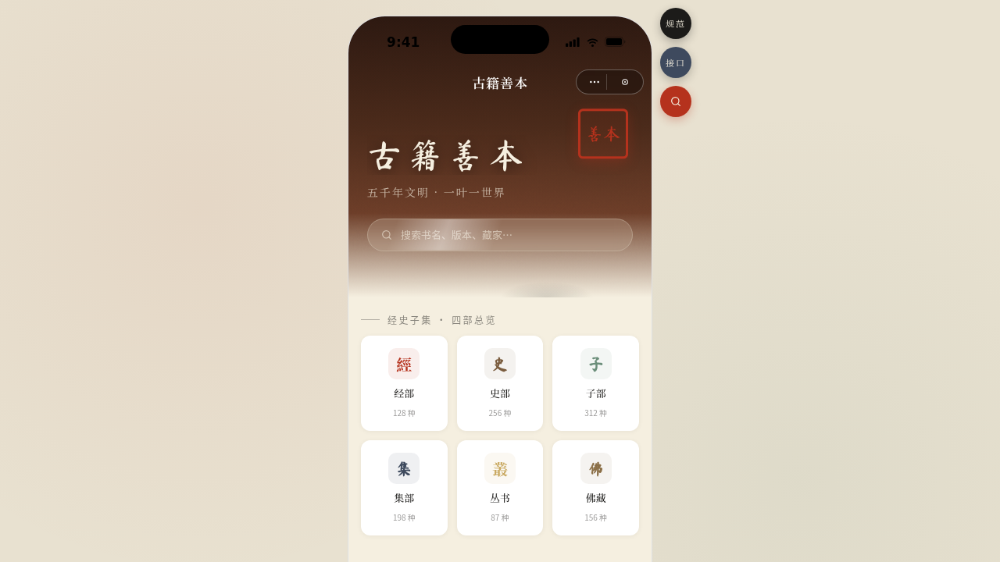

形态：微信小程序

# 古籍善本 · 微信小程序

- 日期：2026-08-18
- 方向：V2 手机 UI（微信小程序形态）
- 主题：古籍善本 · 微信小程序（线装本收藏与展览社区）
- 创作领域：文化艺术（古籍善本 / 非遗传承）

## 简介

套在统一手机外壳内的古籍善本微信小程序，含首页卡片流、分类吸顶筛选、善本详情吸底操作、砚田社区、个人中心等 8 个页面。宣纸米底配朱砂印泥与金线，书法体标题，印章盖章、墨滴扩散等中式动效。小程序端侧交互齐全：页面栈 push/pop、底部 TabBar、ActionSheet、下拉刷新、左滑列表、吸顶 Tab、吸底操作栏、胶囊导航栏。

## 截图

## 动效亮点

印章盖章弹跳、毛笔刷揭示、墨滴扩散、视差滚动详情、骨架屏加载、环形进度头像、卡片 3D 倾斜、光泽扫过、涟漪点击、TabBar 弹跳等 12+ 种。

## 文件说明

| 文件 | 说明 |
|---|---|
| index.html | 完整可运行源码（含内联 CSS / JSX / JS） |
| components/ | 组件目录（构建产物） |
| 设计规范.md | 色彩、字体、页面结构、动效、组件规范 |
| preview.png | 页面预览截图 |

## 妙搭在线预览

https://dcniaqwtmoca.feishu.cn/page/RqopmLUtAdonKZa6hZUcCbMsn6d

## 技术栈

React 18 + Babel Standalone（全部内联于单文件 index.html），纯前端无后端。
