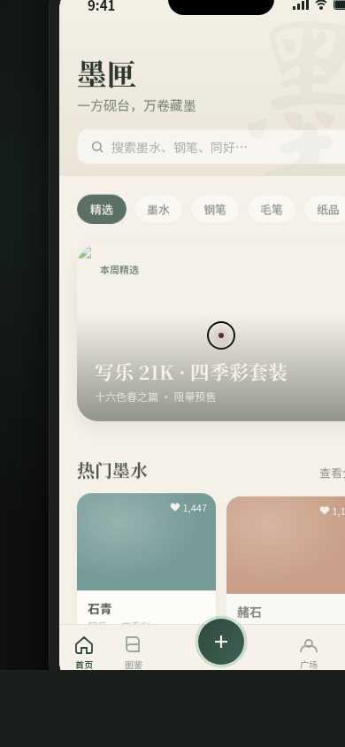

# 墨匣 · 文具与墨水爱好者社区 App

形态：原生 App

## 截图预览

## 妙搭在线预览

https://dcniaqwtmoca.feishu.cn/page/OELwm7F8JdR7JIaZfC1caaFEnsh

## 项目概述

「墨匣」是一款面向文具与墨水爱好者的原生 App 社区产品。用户可以在 App 中浏览精选墨水、查阅墨水图鉴、分享文具心得、与同好交流。整体视觉以墨青色为主调，辅以赭石、石青等中国传统色彩，营造温润雅致的文房气质。

## 页面结构

共 8 个页面，涵盖功能页 + 规范页 + 接口文档页：

| 序号 | 页面 | 布局特色 |
|------|------|----------|
| 1 | 首页精选 | Hero 卡片 + 色卡网格 + 横向分类滚动 |
| 2 | 墨水图鉴 | 瀑布流布局 + 深色头部 + 筛选条 |
| 3 | 钢笔/墨水详情页 | Hero 大图视差 + 色值选择器 + 底部操作栏 |
| 4 | 社区广场 | Segmented Control + 卡片信息流 + 长按菜单 |
| 5 | 发布动态（模态） | 底部弹出 Sheet + 九宫格照片 + 快捷入口 |
| 6 | 个人中心 | 渐变封面 + 环形统计 + 功能列表分组 |
| 7 | 设计规范 | 色板 + 字体 + 组件 + 间距 + 圆角 |
| 8 | 接口文档 | 代码块高亮 + 分组标签 + 参数表格 |

## 原生端侧交互

- ✅ 大标题导航栏（Large Title）+ 滚动后收缩为普通标题
- ✅ 返回栈导航（Navigation Stack）— 详情页、规范页、文档页均可左滑返回
- ✅ 原生底部 TabBar（毛玻璃质感 + 中间凸起 FAB）
- ✅ 卡片式信息流（Feed Card）
- ✅ 全屏详情页转场（从右侧滑入/滑出）
- ✅ 模态弹窗（底部 Sheet 弹出 + 背景半透明遮罩）
- ✅ 下拉刷新（弹性阻尼 + 加载指示器）
- ✅ 悬浮操作按钮 FAB（脉冲呼吸 + 点击发布）
- ✅ 长按快捷菜单（长按 Feed 卡片弹出操作菜单）

## 动效清单（15 个组件级特效）

1. **自定义光标** — 白色粗环 + 石青内点 + 多层发光，悬停放大变环，点击涟漪
2. **入场序列动画** — 首页各元素错峰从下淡入，0.05s 级差
3. **3D 卡片倾斜** — Hero 卡片随鼠标位置做 3D 透视倾斜
4. **滚动渐入** — 瀑布流 / 卡片进入视口时淡入上浮
5. **视差滚动** — 详情页 Hero 大图随滚动产生视差位移
6. **数字计数动画** — 点赞数、粉丝数 ease-out 滚动到目标值
7. **Tab 切换滑动指示条** — Segmented Control 下划线弹性滑动
8. **卡片悬停上浮** — 墨水色卡悬停上移 + 阴影加深
9. **印章盖下动画** — 个人页认证徽章弹压盖下
10. **光泽扫过** — 详情页「加入购物车」按钮金色光泽扫动
11. **脉冲呼吸** — FAB 发布按钮脉冲环动画
12. **下拉弹性** — 首页下拉刷新阻尼弹性
13. **环形进度** — 个人中心四个统计环形图逐一填充
14. **色值选择器** — 色号切换时圆环缩放 + 外圈涟漪
15. **页面转场** — 二级页从右侧滑入，返回时向右侧滑出

## 配色体系

| 角色 | 颜色 | 用途 |
|------|------|------|
| 主色 | #2d4a3e 墨青 | 导航 / 主按钮 / 强调 |
| 辅助色 | #7fb89a 石青 | 次强调 / 进度 / 选中态 |
| 强调色 | #8b4513 赭石 | 价格 / 警示 / 重要标记 |
| 点缀色 | #c9974b 赤金 | 星级 / 徽章 / 装饰 |
| 背景色 | #f5f1e8 宣白 | 页面底色 |
| 文字色 | #1a241e 墨黑 | 主要文字 |
| 次文字 | #6a776f | 次级文字 / 说明 |
| 分割线 | #ebe5d8 | 分割线 / 边框 |

## 技术实现

- 单文件 HTML + 内联 React JSX（Babel Standalone 浏览器端转译）
- 纯 CSS 动画 + requestAnimationFrame 驱动的光标与视差
- IntersectionObserver 实现滚动渐入与数字计数
- 支持 prefers-reduced-motion 降级
- visibilitychange 自动暂停动画循环防止泄漏

## 版本信息

- 日期：2026-08-18
- 形态：原生 App（V2 形态 A）
- 领域：墨水文具社区
- 配色：墨青 + 石青 + 赭石 + 赤金 + 宣白
