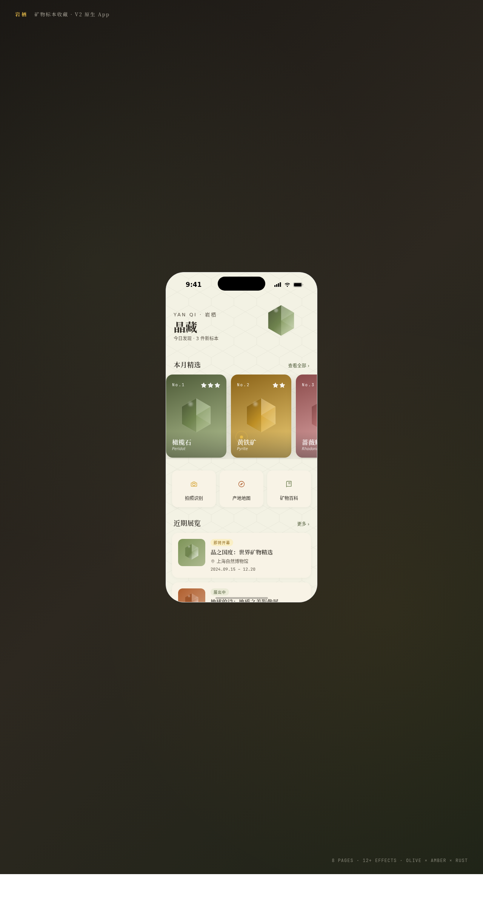

# 岩栖 · V2 手机 UI

形态：原生 App

**日期**：2026-08-18
**方向**：V2 手机 UI（原生 App 形态）
**主题**：岩栖 —— 矿物标本收藏 App

## 简介
面向矿物爱好者与收藏家的原生 App，提供标本管理、矿物识别、晶藏展览、个人田野笔记等功能。8 个页面含 5 种以上独特布局，7 种原生端侧交互，20+ 组件级动效。

## 设计说明
- 配色：橄榄林绿（主）+ 琥珀金（强调）+ 赭石铁锈（辅）+ 羊皮纸米（表面）+ 蔷薇辉粉（点缀），完全避开蓝紫
- 字体：Noto Serif SC（展示衬线）+ Noto Sans SC（正文）+ JetBrains Mono（数据）
- 签名元素：晶面六边几何纹理、博物馆标签美学、晶面旋转光移动效

## 动效亮点
- 晶面浮动入场+光泽扫过
- 下拉刷新六边形自旋
- 矿物识别扫描线移动+频谱柱跳动
- FAB 弹性缩放+Tab 指示器弹性滑动
- 自定义光标三态 morph+点击涟漪

## 截图

## 妙搭在线预览
https://dcniaqwtmoca.feishu.cn/page/CVG9mOUxqdMBpnaNqVmcJ4PsnGg

## 文件说明
| 文件 | 说明 |
|------|------|
| index.html | 完整源码（单文件 vanilla React） |
| components/ | 组件源码（ios-frame.jsx、tweaks-panel.jsx） |
| preview.png | 页面截图 |
| 设计规范.md | 色彩系统、字体、组件、动效规范 |
| thumbnail.png | 缩略图 |

## 技术栈
单文件 vanilla React，内联 JSX/CSS，无外部 CDN 依赖
