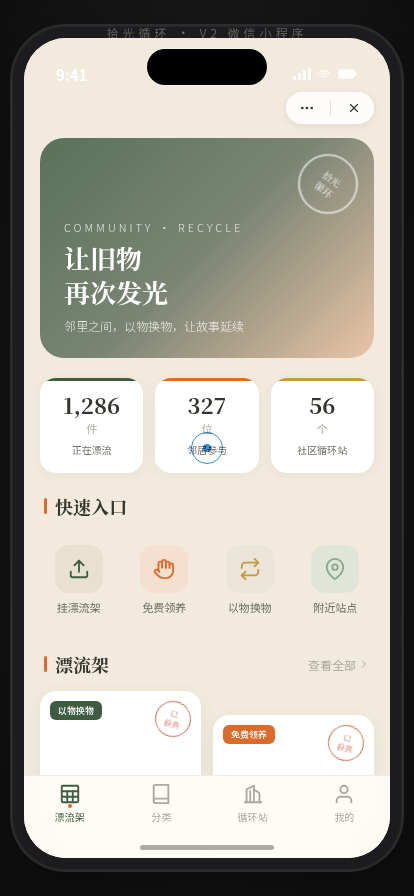

# 拾光循环 · V2 手机 UI（微信小程序）

> 日期：2026-08-18 · 方向：V2 手机 UI · 形态：微信小程序 · 主题：社区旧物循环置换小程序

形态：微信小程序

## 简介

「拾光循环」是微信小程序形态的社区旧物循环置换应用：邻里把闲置旧物（旧书、胶片相机、搪瓷杯、老家具、黑胶、玩具）挂上"漂流架"，以物换物或免费领养。复古绿与旧纸米的配色还原旧物的温润质感，8 个页面在统一手机外壳内切换，含胶囊按钮自定义导航栏、底部 TabBar、半屏 ActionSheet、下拉刷新弹性回弹等小程序端侧交互。

## 动效亮点

- 首页入场序列动画、详情页视差滚动
- 个人页环形进度填充、邮戳印章盖印
- 列表下拉弹性回弹、TabBar 选中弹跳
- 自定义光标开页居中、悬停变形、点击涟漪

## 文件说明

| 文件 | 说明 |
|---|---|
| index.html | 完整可运行源码（React + Babel JSX 全内联） |
| 设计规范.md | 色彩 / 字体 / 组件 / 动效 / 页面结构（含形态标记） |
| preview.png | 手机端截图 |

## 在线预览

https://dcniaqwtmoca.feishu.cn/page/RFCbmfbfWdE4k5aNnMxcjVUonqk

## 技术栈

React 18 + Babel standalone（JSX 全内联于 index.html），原生 CSS，RAF 物理动画，prefers-reduced-motion 支持。
