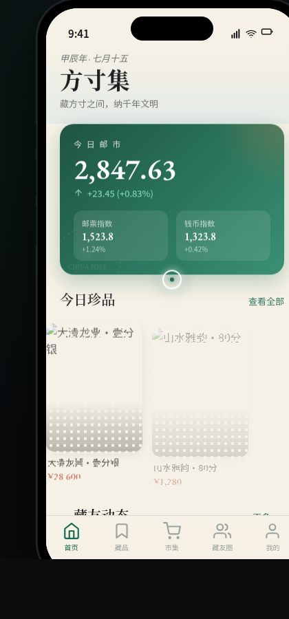

# 方寸集 · V2 手机 UI

形态：原生 App

- 日期：2026-08-18
- 方向：V2 手机 UI（原生 App 形态，完整多页面手机端 mock）
- 主题：方寸集——邮票与钱币收藏者的 App
- 配色：翡翠墨绿 + 铜币橙 + 邮戳红 + 宣纸米（禁止蓝紫渐变）

## 简介

一款面向邮票钱币收藏者的原生 App。8 个页面套在统一手机外壳内可切换：首页邮市行情、藏品瀑布流、市集信息流、全屏详情转场、藏友圈对角分割、我的成就勋章网格，含设计规范页与接口文档页。围绕邮票钱币收藏领域组织真实可信内容，非 lorem ipsum。

## 动效亮点

- 自定义光标（白环 + 翡翠墨绿内点 + 多层发光，悬停变形，点击涟漪）
- 邮票齿孔光泽扫过 + 钱币 3D 翻转
- 首页邮戳盖印入场签名动效
- 详情页 Hero 视差滚动签名动效
- 弹簧入场 + 环形进度 stroke-dashoffset + 渐变头像环
- 筛选 Chip 弹簧切换 + Tab 下划线滑动 + FAB 旋转

## 原生端侧交互

底部 TabBar、返回栈导航、下拉刷新弹性、长按快捷菜单、悬浮 FAB、模态弹窗（≥6 种）。

## 文件说明

| 文件 | 说明 |
|---|---|
| index.html | 完整源码（HTML/CSS/JS + Babel JSX 内联） |
| 设计规范.md | 色彩系统、字体、组件、动效、页面结构、形态标记 |
| preview.png | 页面截图 |

## 妙搭在线预览

https://dcniaqwtmoca.feishu.cn/page/Oja1mU9RTdijyhaw033c8svxnCh

## 技术栈

HTML/CSS + React（JSX 内联于 `<script type="text/babel">`），无外部 src 引用。
