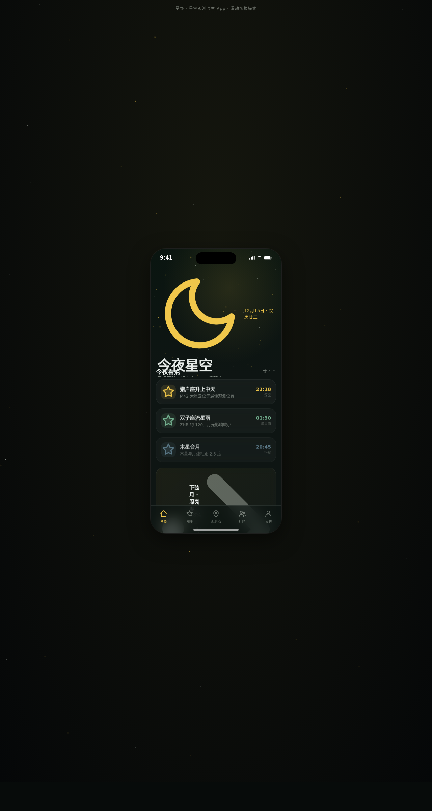

# 星野 · 星空观测 App

形态：原生 App

> 日期：2026-08-18 · 方向：V2 手机 UI · 形态：原生 App · 主题：星空观测与拍摄社区

## 简介

面向天文爱好者的星空观测与拍摄社区原生 App，深青黑夜空 + 星黄 + 观测红的配色。在统一手机外壳内可切换 8 个页面：今夜天象、星座图鉴、观测点地图、社区、我的、天象日历、设计规范、接口文档。内容含真实星座/天体名称。原生端侧交互含底部 TabBar、大标题导航栏 + 返回栈、下拉刷新、FAB、底部半屏抽屉、模态详情页转场。

## 动效亮点

- 首页 Hero 星空视差 + 流星划过 + 堆叠卡片入场序列
- 观测点地图脉冲标记 + 旋转指南针
- 个人页环形进度等级描边
- 下拉刷新弹性回弹
- 发光呼吸、弹跳进入、页面切换过渡

共 12+ 组件级特效。Tweaks 面板支持主色调切换、红光夜视模式、动画强度调节。

## 妙搭在线预览

https://dcniaqwtmoca.feishu.cn/page/FZQQmi7qHd2xvCaGDsicgBldnBh

## 文件说明

| 文件 | 说明 |
|------|------|
| index.html | 完整可运行源码（含内联 CSS/JS/Babel JSX） |
| 设计规范.md | 色彩系统、字体、组件、动效、页面结构、形态标记 |
| preview.png | 页面截图 |
| README.md | 本说明 |

## 技术栈

React 18 + Babel Standalone（JSX 全部内联在 `<script type="text/babel">`），SVG + CSS 动画，纯前端单文件。

## 备注

生成源码中 `-webkit-backdrop-filter` 样式键未加引号导致 Babel 编译白屏，已修复（引号包裹）并重新部署，在线链接可正常访问。
