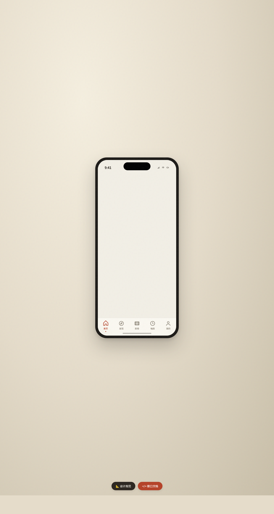

# 暗房日记 · V2 手机 UI

**形态：原生 App**

## 轮次信息
- 日期：2026-08-18
- 版本：V2 手机 UI
- 形态：原生 App（交替判定：上一次为「微信小程序」，本次为「原生 App」）
- 创作领域：收藏爱好 / 胶片摄影
- 主题：暗房日记 — 胶片摄影爱好者的暗房冲洗与档案 App

## 简介

一款原生 App 形态的胶片摄影应用，含 8 个页面：首页 / 发现 / 胶卷 / 暗房 / 详情 / 我的 / 设计规范 / 接口文档。暖纸 + 安全灯红 + 黄铜 + 鼠尾草绿的胶片质感，每页有独立色彩主角与独特布局。

## 截图

## 动效亮点

- 首页 Hero「胶片显影」入场：过曝 → 对比度饱和 → 全彩显影序列
- 个人页环形进度：Canvas 三色渐变描边，easeOutCubic
- 12+ 组件级动效：Tab 弹性回弹、快门红光闪烁、FAB 呼吸、安全灯脉动等

## 原生交互要素

底部 TabBar、返回栈导航、FAB 悬浮操作按钮、横滑胶片条、下拉滚动弹性、模态式详情页转场。

## 文件说明

| 文件 | 说明 |
|------|------|
| index.html | 完整可运行源码（含内联 CSS / JSX） |
| preview.png | 页面截图 |
| thumbnail.png | 妙搭平台缩略图 |
| 设计规范.md | 色彩 / 字体 / 组件 / 动效 / 页面结构规范（含形态标记） |

## 妙搭在线预览

https://dcniaqwtmoca.feishu.cn/page/InLEmZUVMdpCNsagayScvc07nLb

## 技术栈

React 18 + Babel standalone（全部内联）+ Canvas 2D + RAF
