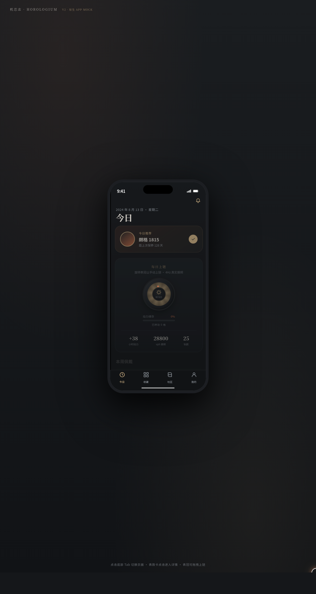
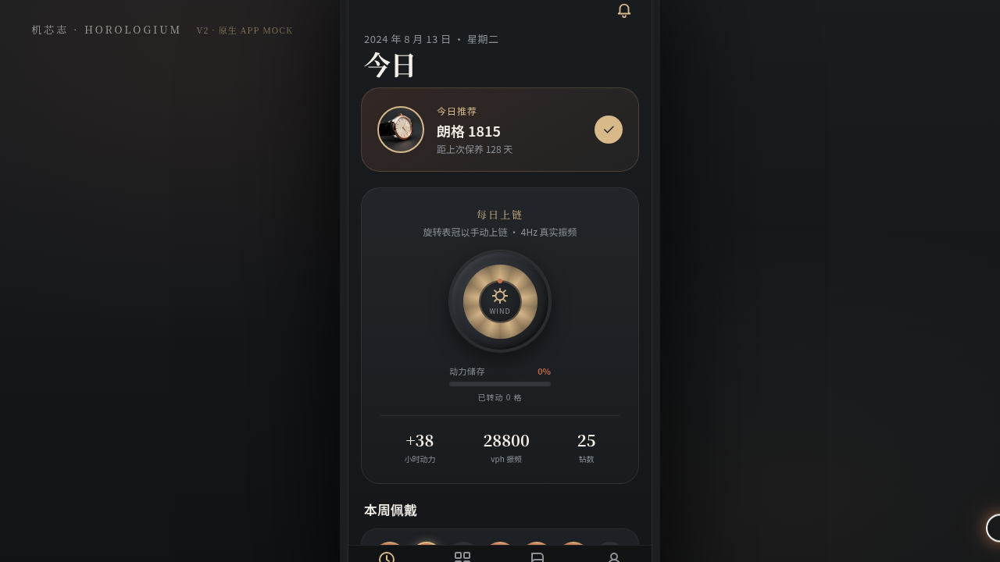

# 机芯志 Horologium · 机械表收藏与养护

形态：原生 App

- 日期：2026-08-18
- 方向：V2 手机 UI（形态 A：原生手机 App）
- 主题：机械表爱好者的收藏管理、机芯百科与养护周期提醒

## 设计说明

石墨黑+钛灰打底，赤铜为强调、香槟金点缀，像一枚深色表盘上的铜质指针。8 个页面（今日/收藏库/表款详情/养护记录/机芯百科社区/我的/设计规范/接口文档）在统一手机外壳内切换，每页布局独立：瀑布流、Hero 视差画廊、垂直时间线、网格拼贴、环形进度等，无换皮套壳。内容使用真实机芯术语（ETA 2824-2、Sellita SW200、振频 28800vph、动力储存等）。

## 动效亮点

- 摆轮游丝振荡（4Hz 真实节律，带振幅微扰动）
- 表冠拖拽上链：阻尼回弹 + 动力储存条联动
- 收藏库下拉齿轮啮合刷新、松手回弹
- 大标题导航滚动收缩、TabBar 选中弹跳、全屏详情转场、长按/模态/FAB 等 7 种原生交互
- 自定义光标（阻尼跟随外环+内点+悬停变形+点击涟漪）、数字计数、光泽扫过等 12+ 组件特效

## 文件说明

| 文件 | 说明 |
|---|---|
| index.html | 应用入口（React + Babel CDN，JSX 全部内联） |
| components/ | 组件源码（ios-frame.jsx 手机外壳） |
| 设计规范.md | 色彩/字体/页面/交互/动效设计令牌 |
| preview.png | 本地渲染长截图（1280×2400） |
| thumbnail.png | 平台生成缩略图 |

## 在线预览

妙搭应用：https://dcniaqwtmoca.feishu.cn/page/TdmSmllEedrHbZa1351cjgVpnjI

## 技术栈

React 18 + Babel standalone（JSX 内联于 index.html），内联 CSS，RAF 物理动效，支持 prefers-reduced-motion。
