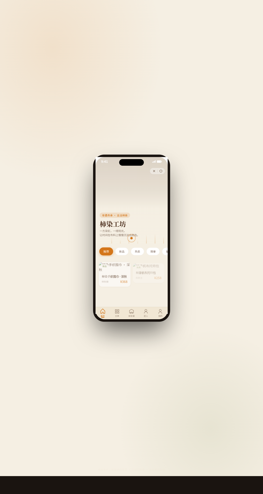

形态：微信小程序

# 柿染工坊 · V2 手机 UI（微信小程序）

> 日期：2026-08-18 · 方向：V2 手机 UI · 形态：微信小程序 · 主题：传统柿染工坊小程序

## 概述

一个传统柿染（柿漆染布）工坊的微信小程序，包含 8 个页面：首页瀑布流作品展示、分类筛选、作品详情、体验课预约、匠人故事、个人中心、设计规范页、接口文档页。围绕柿染手工艺组织真实可信的内容。

## 配色

柿染大地色系：柿橙 #D4761A / 自然米 #F0E6D2 / 深棕 #4A2C1A / 苔绿 #6B7F3E / 晒日金 #E8B94D。禁止蓝紫渐变。

## 小程序特性

胶囊按钮导航栏、底部 TabBar（选中微动效）、页面栈 push/pop 右滑返回、半屏 ActionSheet、下拉刷新（染料水滴动效）、吸顶 Tab、骨架屏加载，共 7 种端侧交互。

## 动效亮点

- 首页签名动效：阳光光束摇曳 + 染料滴落溪流
- 详情页签名动效：大图浸染入场（从上至下慢慢染色）
- 按钮墨水扩散涟漪
- 下拉刷新染料水滴
- 瀑布流卡片逐个显现
- 自定义光标（白色粗环 + 柿橙内点 + 点击涟漪）

## 文件说明

| 文件 | 说明 |
|------|------|
| index.html | 完整单文件源码（HTML + CSS + JS 内联） |
| preview.png | 页面截图 1280×2400 |
| 设计规范.md | 色彩系统、字体、组件、动效、页面结构规范（含形态标记） |

## 妙搭在线预览

https://dcniaqwtmoca.feishu.cn/page/Vgdvmvkg2d15RIa5r70cIYMdnIb

## 技术栈

纯 vanilla HTML/CSS/JS 单文件实现，无 React / 无 Babel / 无外部 CDN 依赖。
