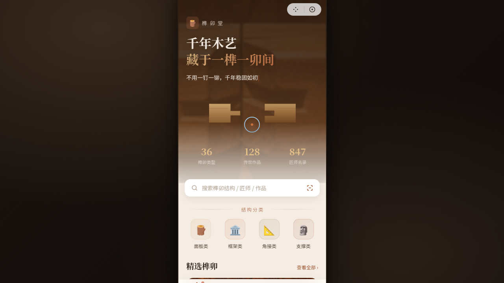

# 榫卯堂 · 微信小程序 V2

**形态：微信小程序**

## 轮次信息
- 日期：2026-08-18
- 版本：V2 手机 UI
- 形态：微信小程序（交替判定：上一次为「原生 App」，本次为「微信小程序」）
- 创作领域：文化艺术 / 非遗传承（传统榫卯木作）
- 主题：榫卯堂 — 千年木艺，藏于一榫一卯间

## 项目概述
榫卯堂是一款以中国传统榫卯木结构为主题的微信小程序，涵盖榫卯图鉴、匠人工坊、个人研习等功能，旨在通过数字化方式传承与展示千年营造智慧。

## 页面结构（8 页）
1. **首页** - Hero 大标题 + 榫卯拼装入场动画 + 数据统计 + 快捷分类 + 精选榫卯 + 匠师名录
2. **图鉴页** - 吸顶 Tab 分类 + 双列瀑布流卡片 + 下拉刷新 + 骨架屏
3. **详情页** - 视差滚动 Hero + 榫卯拆解互动动效 + 吸底操作栏 + 滚动吸顶导航
4. **工坊页** - 浮动热门卡片 + 工坊列表流 + 匠师脉冲头像
5. **个人中心** - 环形进度成就 + 宫格功能入口 + 左滑操作收藏列表（列表/宫格切换）
6. **设计规范页** - 色彩系统 / 字体排印 / 组件规范 / 动效规范
7. **接口文档页** - 4 个可折叠 API 接口 + 错误码表
8. **（首页 Hero 拼装动画）** - 页面级签名动效

## 小程序端侧交互（7 种）
- ✅ 胶囊按钮导航栏（右上角 ··· / ⊙）
- ✅ 页面栈 push/pop 切换（右入左出过渡）
- ✅ 底部 TabBar（4 个，选中态脉冲微动效）
- ✅ 半屏弹层 ActionSheet（分享菜单）
- ✅ 下拉刷新（弹性回弹 + 骨架屏）
- ✅ 左滑列表操作（收藏列表左滑删除/置顶）
- ✅ 吸顶 Tab（图鉴分类）
- ✅ 吸底操作栏（详情页底部按钮栏）
- ✅ 骨架屏加载

## 动效清单（15+ 组件级）
1. 自定义光标（白色粗环 + 琥珀内点 + 悬停放大 + 点击涟漪）
2. 打字机效果（首页副标题）
3. 数字计数动画（首页三数据统计）
4. 页面栈切换过渡（右入左出，贝塞尔曲线）
5. 光泽扫过（精选卡片）
6. 脉冲环（TabBar 选中点 / 匠师头像）
7. 入场序列动画（stagger 逐项淡入）
8. 卡片 3D 倾斜（鼠标驱动精选卡片）
9. 榫卯拼装动画（首页 Hero SVG）
10. 榫卯拆解互动（详情页 SVG 拆解/组合）
11. 浮动动画（工坊热门卡片）
12. 环形进度（个人中心研习进度）
13. 卡片悬浮位移（列表项 hover）
14. 按钮涟漪（点击波纹）
15. TabBar 图标弹性微动效
16. 滚动视差（详情页 Hero 图）
17. 滚动吸顶变色（详情页导航栏）

## 配色系统
- 主色：檀木棕 #8B4513
- 辅助色：赤铜 #C97145
- 点缀色：砂金 #B8860B
- 背景色：米白 #F5EDE4
- 表面色：素白 #FFFCF7
- 文字色：深褐 #2B1F17

## 字体
- 展示字体：Noto Serif SC（宋体，承载木刻典籍质感）
- 正文字体：Noto Sans SC（黑体，清晰可读）

## 技术实现
- 单文件内联 JSX（遵守平台硬约束）
- React 18 + Babel standalone
- 自定义手机外壳（非 iOS 原生样式，微信小程序特有胶囊+导航）
- 支持 prefers-reduced-motion 降级
- RAF 动画循环随 visibilitychange 自动暂停

## 截图

## 妙搭在线预览

https://dcniaqwtmoca.feishu.cn/page/SVGMmAuqldDMmPaxuDtcg3y9nxg

## 文件说明

| 文件 | 说明 |
|---|---|
| `index.html` | 应用入口（内联 JSX + React18 + Babel standalone，实际预览走妙搭链接） |
| `设计规范.md` | 色彩系统 / 字体排印 / 组件规范 / 动效规范 |
| `thumbnail.png` | 页面截图（1280×720） |
| `README.md` | 本说明 |
