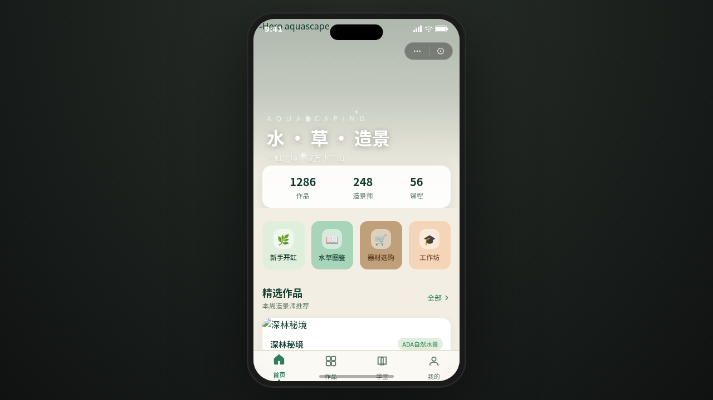

# 水草造景 · 青川（微信小程序）

- **日期**：2026-08-18
- **方向**：V2 手机 UI
- **形态：微信小程序**

## 简介

水草造景（Aquascaping）爱好者微信小程序「青川」。统一手机外壳内可切换 8 个页面：首页水景卡片流、作品瀑布流画廊、作品详情吸底操作栏、造景学堂骨架屏、器材市集左右分栏、工作坊预约半屏弹层、设计规范、接口文档。水潭色系（水草青绿 + 深潭墨绿 + 溪石米白 + 沉木棕 + 樱花虾橘红），每页有独立色彩主角，禁止蓝紫渐变。

## 截图

## 动效亮点

- 签名动效：首页气泡上浮+标题入场、详情页视差滚动、列表下拉弹性水波、我的页环形生长进度
- 小程序端侧交互：胶囊按钮+自定义导航栏、底部 TabBar 弹性选中、页面栈右滑入场、下拉刷新弹性、左滑加购弹簧、吸顶 Tab、半屏弹层、安全区主按钮、骨架屏
- 组件级 12+：气泡粒子、涟漪点击、光泽扫过、数字计数、卡片交错入场等

## 在线预览

[水草造景 · 妙搭在线预览](https://dcniaqwtmoca.feishu.cn/page/CzmEm4OwSdSG7xarCLIcx5H7ndg)

## 文件说明

| 文件 | 说明 |
|---|---|
| index.html | 完整可运行源码（JSX 内联于 script type="text/babel"，CSS 内联） |
| components/ | 组件源码（android-frame.jsx 手机外壳等） |
| 设计规范.md | 色彩 / 字体 / 组件 / 动效 / 形态 / 页面结构规范 |
| preview.png | 页面截图 |
| README.md | 本说明文件 |

## 技术栈

React 18 + Babel standalone（JSX 全内联），妙搭平台运行时。
