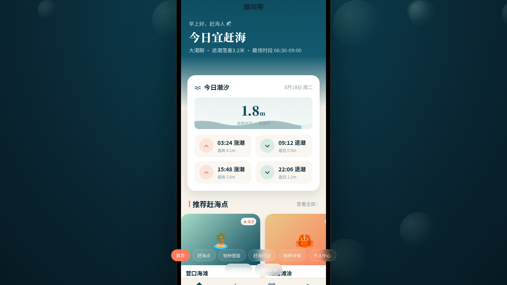

形态：微信小程序

# 潮间带 · 赶海指南小程序

> 日期：2026-08-18 · 方向：V2 手机 UI · 形态：微信小程序 · 主题：赶海指南

## 简介

潮间带是一款微信小程序形态的赶海指南应用，套在统一手机外壳内可切换 8 个页面。涵盖今日潮汐时间表、赶海点推荐、物种图鉴、赶海日记、物种详情、个人中心、设计规范页和接口文档页。以深海青为主色，珊瑚橙为强调色，沙金为辅助色，营造海洋潮间带的视觉氛围。

## 形态

**微信小程序** — 含胶囊按钮导航栏、底部 TabBar、半屏弹层、下拉刷新、左滑操作、吸顶 Tab 等 6 种小程序特有交互。

## 截图

## 动效亮点

- 自定义光标（白环+珊瑚橙内点+发光+点击涟漪）
- 首页入场序列动画（区块依次淡入上浮）
- 潮汐波浪 SVG 动画模拟水位变化
- TabBar 选中态弹跳微动效
- 吸顶 Tab 下划线滑动
- 半屏弹层滑入滑出
- 左滑列表操作
- 骨架屏加载模拟
- 共 13 项组件级特效

## 页面结构（8页）

1. 首页 — 潮汐卡片流 + 赶海点轮播 + 热门文章
2. 赶海点地图 — 不规则拼贴网格 + 吸顶搜索筛选
3. 物种图鉴 — 吸顶分类 Tab + 双列瀑布流
4. 赶海日记 — 左侧竖线时间线 + 左滑操作
5. 物种详情 — Hero 大图 + 吸底操作栏
6. 个人中心 — 头像+宫格+数据统计
7. 设计规范 — 色彩/字体/圆角/组件展示
8. 接口文档 — 分组折叠 API 列表

## 文件说明

| 文件 | 说明 |
|------|------|
| `index.html` | 完整源码（HTML+CSS+JS 单文件） |
| `设计规范.md` | 色彩系统、字体、组件、动效、页面结构规范 |
| `preview.png` | 页面截图 |
| `thumbnail.png` | 缩略图 |

## 妙搭在线预览

https://dcniaqwtmoca.feishu.cn/page/LpjpmHEKGdHjjRaAiDwcLSyfn1g

## 技术栈

纯 vanilla HTML/CSS/JS 单文件，无 React/Babel/CDN 依赖，SVG 动画渲染潮汐波浪。
