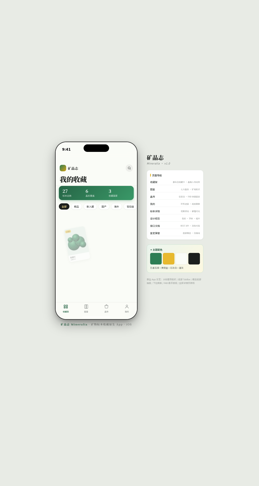

形态：原生 App

# 矿晶志 Mineralia

- **日期**：2026-08-18
- **方向**：V2 手机 UI
- **形态**：原生 App（形态 A）
- **主题**：矿物标本收藏爱好类原生应用
- **配色**：孔雀石绿 + 黄铜金 + 石灰白 + 墨灰（严禁蓝紫渐变）

## 简介

一个完整多页面的原生手机 App mock，套在统一手机外壳内可切换 8 个页面：收藏架（瀑布流 + 晶簇生长入场）、图鉴（七大晶系双列网格）、晶市（信息流 + 黄铜金 FAB 悬浮鉴定）、我的（环形进度 + 成就徽章）、标本详情（视差 + 解理闪光 + 产地地图）、AI 鉴定弹窗（底部模态抽屉 + 扫描线）、设计规范页、接口文档页。内容为真实矿物（孔雀石、萤石、黄铁矿、紫水晶、天河石等）与真实产地。

## 截图

## 动效亮点

- 签名动效 1：收藏架晶簇生长入场（主题语义：晶体逐枝生长）
- 签名动效 2：详情页解理闪光 + 视差滚动（主题语义：晶体解理面反光）
- 14 个组件级特效：棱镜反光、弹簧按压、环形进度、扫描线、置信度条、FAB 弹性入场、Tab 切换、地图脉冲环、底部抽屉弹簧、徽章渐入、下拉刷新弹性、右滑转场等

## 原生 App 交互语言（6 种）

大标题导航栏、底部 TabBar、底部半屏模态抽屉、下拉刷新、FAB 悬浮按钮、全屏详情页右滑转场。

## 在线预览

[矿晶志 · 妙搭在线预览](https://dcniaqwtmoca.feishu.cn/page/BILgmgeGhdnA42a8H54cu4dWned)

## 文件说明

| 文件 | 说明 |
|------|------|
| index.html | 完整源码（HTML + 内联 CSS + 内联 JSX），单文件入口 |
| components/ios-frame.jsx | 手机外壳组件源码（参考用，index.html 已内联全部 JSX） |
| preview.png | 预览截图 |
| 设计规范.md | 色彩系统、字体、组件、动效、页面结构、形态标记 |

## 技术栈

React 18 + Babel standalone（JSX 全部内联于 `<script type="text/babel">`），飞书妙搭平台 CDN；无外部 JSX 文件 fetch。
