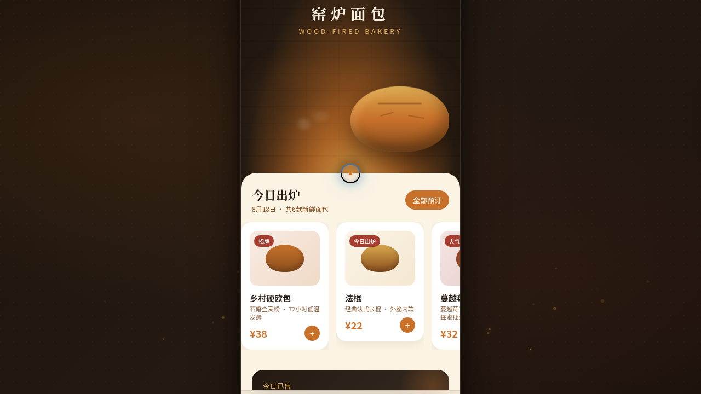

形态：原生 App

# 窑炉面包 Kiln Bakery

> 日期：2026-08-18 · 方向：V2 手机 UI · 形态：原生 App · 主题：窑烤面包房手机应用

## 简介

「窑炉面包」是一家窑烤面包房的原生手机 App mock：炭黑与焦糖琥珀的暖调体系里，窑炉火星在首页缓缓升腾，面包卡片随滚动入场，会员页的麦金环形积分逐格点亮。8 个页面装在统一手机外壳内可自由切换，覆盖今日出炉、瀑布流预订、烘焙日志、会员中心、面包详情、购物车抽屉，以及设计规范与接口文档两页。

## 截图

## 动效亮点

- 首页入场序列动画 + Hero 窑炉大图视差（页面级签名动效）
- 会员页环形积分进度绘制 + 头像脉冲（页面级签名动效）
- 窑炉火星粒子、蒸汽升腾、面包卡片浮动与光泽扫过
- 下拉刷新弹性回弹、FAB 展开旋转、底部半屏购物车抽屉滑入
- 开屏即居中的自定义光标（白环 + 琥珀内点 + 点击涟漪）

## 文件说明

| 文件 | 说明 |
|---|---|
| `index.html` | 完整手机端 mock（JSX 全部内联，含手机外壳） |
| `components/` | 拉取源码附带的组件目录 |
| `preview.png` / `thumbnail.png` | 页面截图 |
| `设计规范.md` | 色彩 / 字体 / 页面结构 / 动效设计令牌 |
| `README.md` | 本文件 |

## 在线预览

https://dcniaqwtmoca.feishu.cn/page/LwevmQ2WGd9IkKadfa8c0byxnD7

## 技术栈

妙搭（Spark）单 HTML 应用 · React（JSX 内联）· Tailwind · 原生 RAF 动效 · 支持 prefers-reduced-motion 降级
