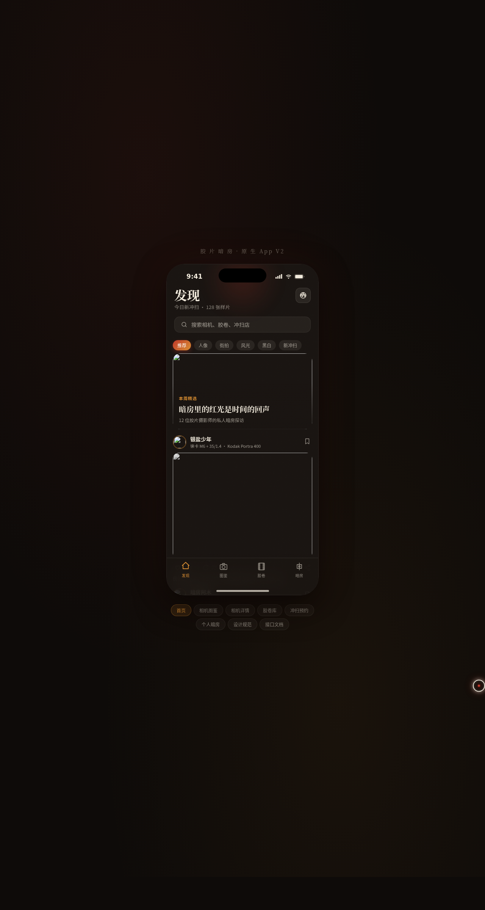

# 胶片暗房 · 胶片相机与冲扫社区

形态：原生 App

- 日期：2026-08-18
- 方向：V2 手机 UI（原生 App 形态）
- 领域：收藏爱好 · 胶片相机与冲扫社区

## 简介

一个胶片摄影社区原生 App mock：社区样片流、相机图鉴（徕卡 M6 / 康泰时 T2 / 禄来 35 等真实机型）、胶卷库（Portra 400 / C200 / HP5 等真实卷型）、冲扫店预约、个人暗房（收藏 + 订单），另含设计规范页与接口文档页，共 8 页在统一 iOS 外壳内切换。配色为暗房安全灯氛围：炭黑深棕底 + 暗房红 + 琥珀 + 米白。

## 截图

## 动效亮点

- 签名动效：显影渐现（灰白→彩色）、快门白闪、安全灯呼吸光晕
- 下拉弹性刷新（显影提示）、胶片过片轮播吸附、环形收藏进度
- 页面切换弹簧过渡、卡片 staggered 入场、FAB 旋转、抽屉弹簧弹出
- 自定义光标：白粗环 + 红内点，开页居中，悬停变色，点击涟漪

## 文件说明

| 文件 | 说明 |
|---|---|
| index.html | 完整应用入口（React + Babel CDN，JSX 全部内联） |
| components/ios-frame.jsx | 手机外壳组件源码 |
| 设计规范.md | 色彩 / 字体 / 页面结构 / 动效规范（含形态标记） |
| preview.png | 页面截图（本地 chromium 渲染） |
| README.md | 本文件 |

## 在线预览

https://dcniaqwtmoca.feishu.cn/page/DId3mK1U1d7AivaTC8cc7NC2nFe

## 技术栈

妙搭 html 应用 · React 18 + Babel standalone（JSX 内联）· RAF 积分器物理动效
