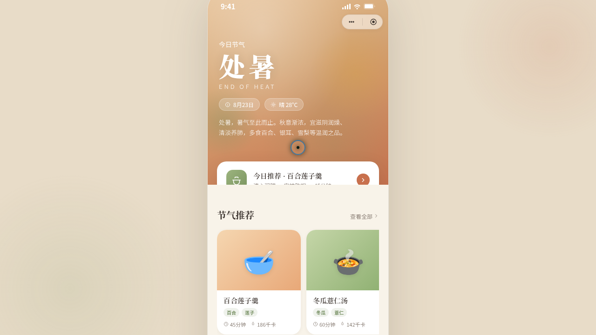

形态：微信小程序

# 节气厨房 · V2 手机 UI

**日期**：2026-08-18  
**方向**：手机 UI  
**形态**：微信小程序  
**主题**：节气厨房 — 跟随二十四节气的时令食谱小程序

## 简介

「节气厨房」是一个微信小程序形态的手机端 mock，以当前节气「处暑」为切入点，推荐当季时令食谱（百合莲子羹、冬瓜薏仁汤、秋葵蒸蛋、桂花糯米藕等），配合食材百科、个人中心等功能，构建一个完整的节气饮食助手小程序。

## 截图

## 设计亮点

- **微信小程序容器**：胶囊按钮导航栏、页面栈 push/pop、底部 TabBar
- **处暑节气主题**：Hero 节气大卡片 + 透明→吸顶导航栏渐变
- **8 页面差异化布局**：卡片堆叠、瀑布流、Hero 视差、宫格+半屏弹层、头像+环形进度
- **端侧交互**：下拉刷新弹性回弹、左滑操作、半屏弹层、骨架屏加载

## 动效亮点

12+ 个组件级特效：自定义光标、TabBar 弹跳、页面过渡、卡片发光、下拉弹性、骨架屏、环形进度、数字计数、半屏弹层、左滑揭示、涟漪、节气入场序列。

## 文件说明

| 文件 | 说明 |
|------|------|
| index.html | 完整可运行源代码（内联 JSX/CSS） |
| 设计规范.md | 色彩系统、字体、组件规范、动效系统、页面结构 |
| thumbnail.png | 页面预览截图 |

## 妙搭在线预览

https://dcniaqwtmoca.feishu.cn/page/ZLVfmmMSGdWf6JaIWqkc3yppnSd

## 技术栈

- HTML / CSS / JavaScript
- JSX 内联在 `<script type="text/babel">` 中
- Babel standalone（内联）
- 纯前端实现，无后端依赖
