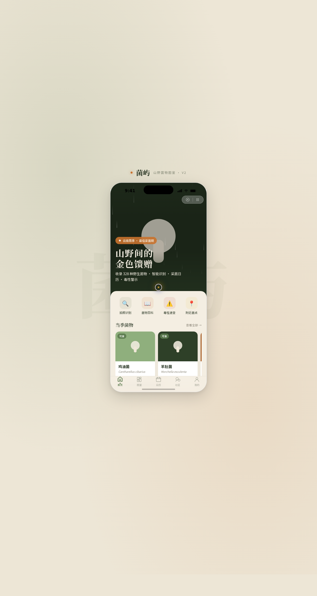

# 菌屿 · 山野菌物图鉴小程序

> 日期：2026-08-18 · 方向：V2 手机 UI · **形态：微信小程序** · 主题：山野菌物图鉴小程序

形态：微信小程序

## 简介

「菌屿」是一件艺术品级的微信小程序形态手机端 mock，围绕野生菌识别、采菌日历、毒性警示、菌物百科、采菌人社区组织真实可信内容。统一手机外壳内 8 页可切换，覆盖典型小程序信息架构但每页布局差异化。配色以苔藓绿 + 深林墨绿 + 菌柄米白为主，鹅黄与赭石橙做强调，禁用蓝紫渐变。

## 截图

## 动效亮点

页面级签名动效：首页雨季雨滴阵列、详情页 Hero 视差滚动。组件级 12+ 项：Tab 弹跳、按钮弹簧缩放、入场错落 fade-up、蘑菇浮动、环形进度数字增长、下拉弹性、左滑抽屉、骨架屏 shimmer、导航栏渐变变色、ActionSheet 缓动上滑。自定义光标白环 + 鹅黄内点，开页居中显示。

## 小程序端侧交互

自定义导航栏 + 胶囊按钮、底部 TabBar 选中弹跳、页面栈 push/pop 右滑感、ActionSheet 半屏弹层、下拉刷新弹性回弹、左滑列表操作、吸顶 Tab、吸底操作栏——8 种端侧交互语言。

## 文件说明

| 文件 | 说明 |
|---|---|
| index.html | 完整可运行源码（React + Babel，JSX 内联） |
| components/ios-frame.jsx | 手机外壳组件 |
| preview.png | 页面截图（1280×2400） |
| thumbnail.png | 妙搭平台缩略图 |
| 设计规范.md | 色彩、字体、组件、动效、页面结构 |
| README.md | 本说明文件 |

## 妙搭在线预览

https://dcniaqwtmoca.feishu.cn/page/PrT2m1hFgdx6uPaxnmfcIfgsnoh

## 技术栈

React 18 + Babel standalone（JSX 内联于 index.html）+ 原生 CSS 动画 + SVG。
