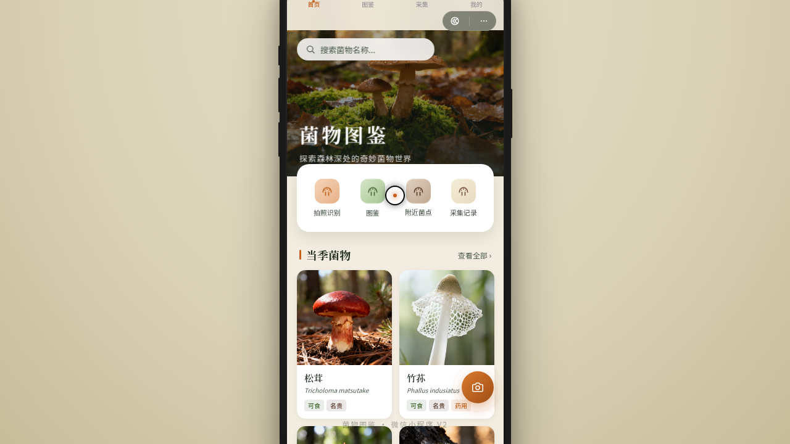

形态：微信小程序

# 菌踪 — V2 手机 UI

**日期：** 2026-08-18
**方向：** V2 手机 UI
**形态：** 微信小程序
**主题：** 菌踪——真菌图鉴与采集记录小程序

## 简介

围绕野生菌物识别与采集记录打造的微信小程序。森林地面暖绿棕色调（菌盖赭橙 + 林苔绿 + 腐木棕 + 孢子白），含首页当季菌物推荐、图鉴分类筛选、菌物详情、采集记录、个人中心等 7 个页面，全部套在带胶囊按钮的小程序导航栏 + 统一手机外壳内。

## 截图

## 动效亮点

- 孢子飘散粒子（签名动效①）—— RAF 驱动孢子随风扩散
- 详情页视差滚动 + 导航栏变色（签名动效②）
- 菌物卡片入场生长动画 + 瀑布流错位入场
- 心型收藏爆裂 + FAB 脉冲光晕
- 共 12+ 组件级动效

## 小程序端侧交互

底部 TabBar 选中弹跳 / 下拉刷新弹性回弹 / ActionSheet 半屏面板 / 左滑列表操作 / 吸顶 Tab 筛选 / 骨架屏加载 / 底部安全区主按钮（共 7 种）

## 文件说明

| 文件 | 说明 |
|------|------|
| index.html | 完整可运行源码（React + Babel 内联 JSX + 内联 CSS） |
| 设计规范.md | 色彩系统、字体、组件、动效、页面结构（含形态标记） |
| preview.png | 页面截图 |
| thumbnail.png | 平台缩略图 |

## 妙搭在线预览

https://dcniaqwtmoca.feishu.cn/page/Oln8mg7ogdlf4paXCuucYwS0nrc

## 技术栈

React + Babel 内联 JSX，CSS 内联。RAF 动画随 visibilitychange 暂停，高频事件直接操作 DOM transform，支持 prefers-reduced-motion。
