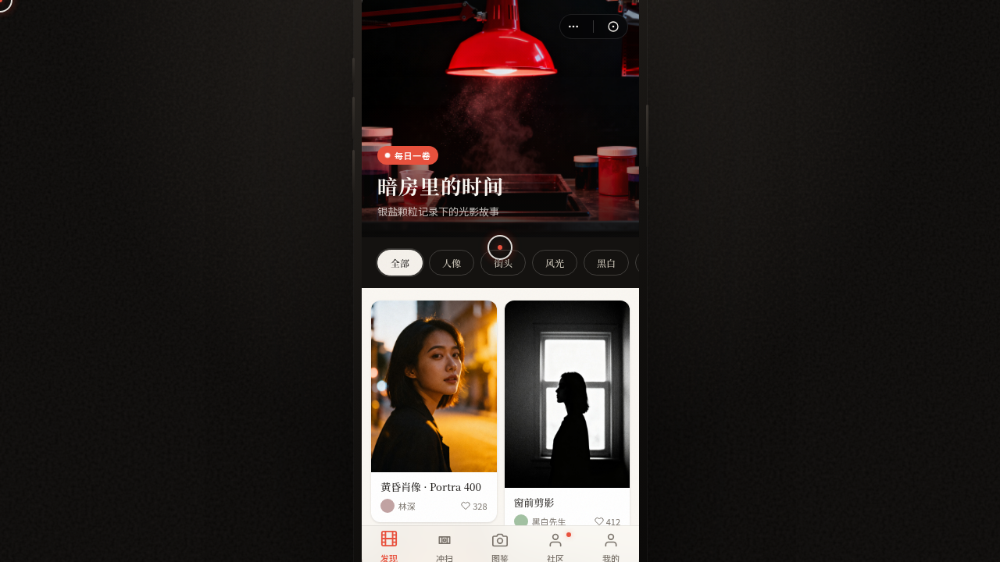

# 银盐公社 · V2 手机 UI

形态：微信小程序

**日期**：2026-08-18
**方向**：手机 UI（V2）
**主题**：银盐公社（胶片摄影冲扫社群微信小程序）

## 简介
一个胶片摄影社群 + 胶片冲扫服务的微信小程序，炭黑 + 暗房安全灯红 + 米白 + 银灰的暗房美学。8 个页面（首页发现/冲扫服务/相机图鉴/作品详情/社区活动/个人中心/设计规范/接口文档）在统一手机外壳内切换，含真实胶卷型号（Kodak Portra 400、Fujifilm C200）、真实相机（Nikon FM2、Contax T2）、冲扫工艺（C-41/E-6/D-76）等内容。

## 截图

## 动效亮点
Hero 入场序列、暗房安全灯脉冲、瀑布流错峰、Tab 弹跳、视差滚动（详情页签名）、环形进度（个人页签名）、点赞粒子、头像光环旋转等 12+ 项。

## 妙搭在线预览
https://dcniaqwtmoca.feishu.cn/page/RLvkmQ0dwdn3huattM6cUirrn9i

## 文件说明
| 文件 | 说明 |
|---|---|
| index.html | 完整可运行源码（单文件，内联 CSS/JS/Babel） |
| 设计规范.md | 色彩系统、字体、页面结构、动效系统、形态标记 |
| preview.png | 页面截图 |
| thumbnail.png | 缩略图 |

## 技术栈
单文件 HTML + 内联 React/Babel，自定义光标 + RAF 物理动效，支持 prefers-reduced-motion。
