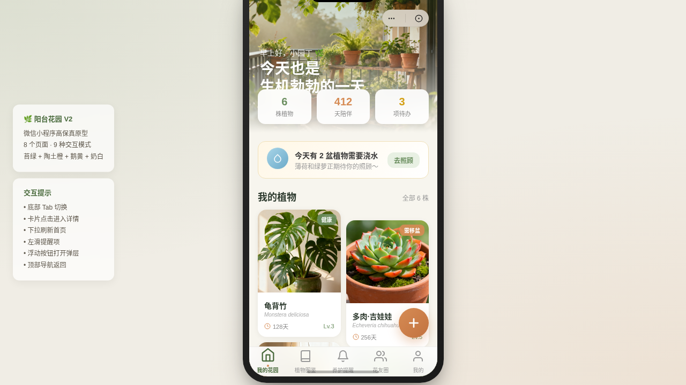

# 阳台花园 Balcony Garden

形态：微信小程序

> 方向：V2 手机 UI · 日期：2026-08-18
> 主题：阳台园艺种植微信小程序（V2 双形态交替：上一轮最新为原生 App「麦芽笔记」，本次交替为微信小程序）

## 简介

「阳台花园」是阳台园艺种植微信小程序，运行在带胶囊按钮的自定义导航栏之下，套在统一手机外壳内。包含我的花园、植物图鉴、养护提醒、花友圈、个人中心、植物详情、设计规范、接口文档共 8 个页面，每页布局差异化，内容真实可信（真实植物品种、养护知识、花友帖子）。

## 动效亮点

- 首页入场序列动画（stagger fade-up，植物生长语义）
- 环形进度卡片 + 叶片摇曳 + 水滴浮动
- 9 种小程序端侧交互：页面栈 push/pop、TabBar 选中微动效、半屏弹层、下拉刷新弹性、左滑操作、吸顶 Tab、吸底主按钮、骨架屏、浮动操作球

## 文件说明

| 文件 | 说明 |
|------|------|
| index.html | 完整可运行源码（JSX/CSS 全内联） |
| frame/ | 手机外壳帧资源 |
| thumbnail.png | 页面截图 |
| 设计规范.md | 色彩/字体/组件/动效/页面结构规范 |

## 在线预览

[阳台花园 · 妙搭在线预览](https://dcniaqwtmoca.feishu.cn/page/I1owm0fTJdVUBEaTU6icHGsLn4f)

## 技术栈

React 18 + Babel Standalone（全内联），纯前端单页，无后端依赖。
