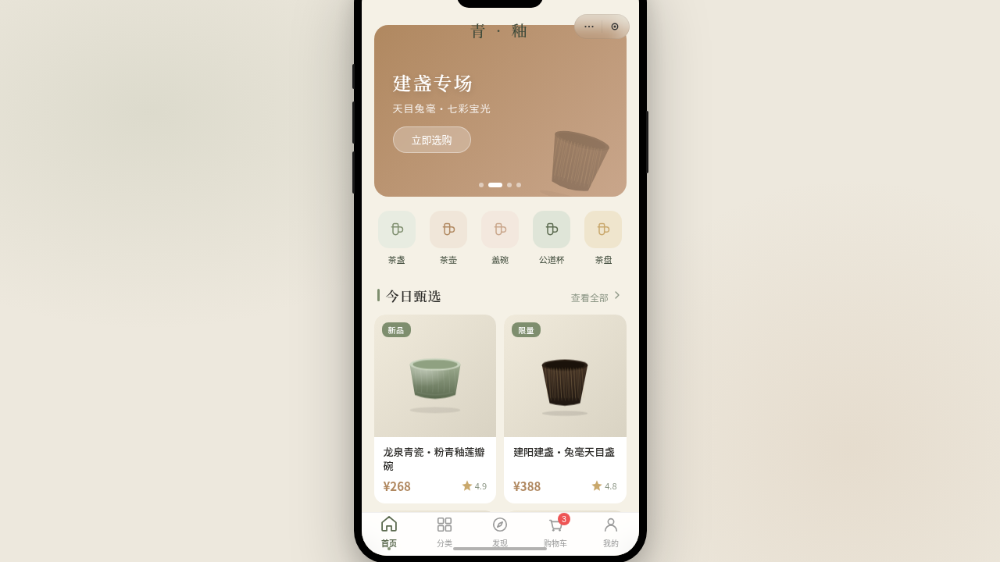

形态：微信小程序

# 青釉 · 茶器美学电商小程序

**形态：微信小程序**

> 日期：2026-08-18 · 方向：V2 手机 UI · 主题：茶器美学电商

青釉瓷色系（灰绿釉色 + 陶土褐 + 米白）的茶器美学电商微信小程序。8 个页面运行于带胶囊按钮的自定义导航栏之下、统一手机外壳内，覆盖首页瀑布流、左右分栏分类、发现页、左滑购物车、环形进度个人中心、视差详情页，以及设计规范与接口文档页。

## 动效亮点

- 首页入场错峰 fade-up 序列（签名动效）
- 商品详情 Hero 视差滚动 + 导航透明→实色渐变（签名动效）
- 个人中心环形进度生长动画（签名动效）
- TabBar 选中弹性微动效、下拉刷新弹性回弹、左滑列表操作
- 悬浮茶器多周期浮动呼吸、按钮涟漪、爱心弹跳、光泽扫过

## 文件说明

| 文件 | 说明 |
|------|------|
| `index.html` | 完整应用入口（JSX/CSS 内联） |
| `components/ios-frame.jsx` | 手机外壳组件源码 |
| `设计规范.md` | 色彩/字体/页面/动效规范（含形态标记） |
| `preview.png` / `thumbnail.png` | 页面截图 |
| `README.md` | 本文件 |

## 在线预览

https://dcniaqwtmoca.feishu.cn/page/UaXsm2ItKd3uhFaD1wdcalCmnFb

## 技术栈

妙搭 HTML 应用 · React（Babel 内联 JSX）· 小程序端侧交互模拟（页面栈 / 胶囊导航 / TabBar / 半屏弹层）
