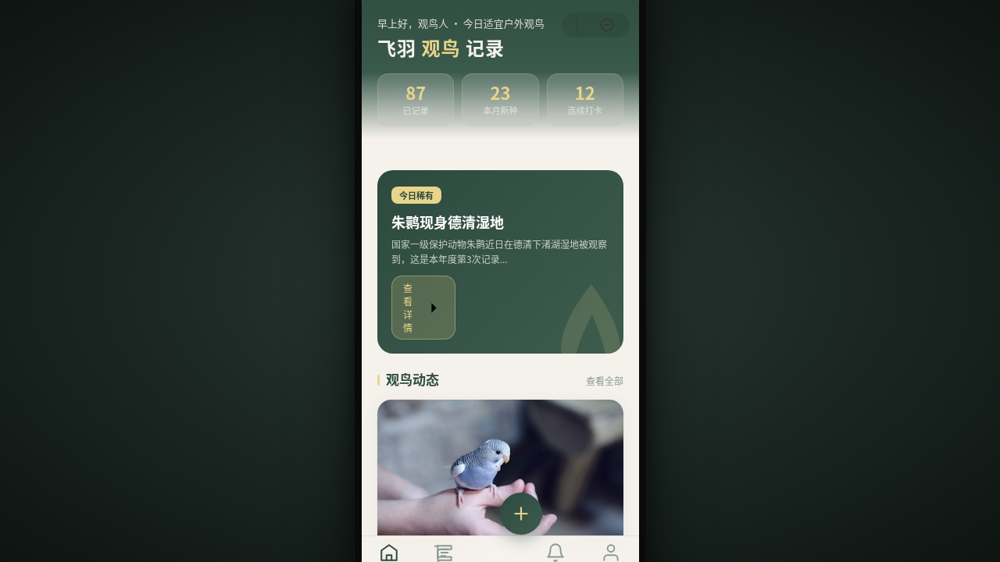

形态：微信小程序

# 飞羽 · 观鸟记录小程序

> 方向：V2 手机 UI　形态：微信小程序　日期：2026-08-18

## 形态标记

**形态：微信小程序**

一款面向观鸟爱好者的微信小程序，覆盖观鸟动态、图鉴浏览、鸟类详情、记录发布、个人中心、消息通知等完整流程。配色取墨绿 + 鹅黄 + 雾灰 + 米白，契合自然探索主题。内容围绕真实鸟种（如白头鹎、红嘴蓝鹊、戴胜等）组织，无占位文本。

## 截图

## 小程序端侧交互

胶囊按钮导航栏、页面栈 push/pop 右滑返回、底部 TabBar（5 项 + 悬浮发布按钮）、ActionSheet 半屏弹层、下拉刷新弹性回弹、吸顶分类 Tab、表单页安全区主按钮、骨架屏加载——8 种端侧交互语言。

## 动效亮点

- 羽毛飘落入场序列（首页）
- 环形进度动画（个人页观鸟统计）
- 滚动视差 + 收藏心跳（详情页）
- TabBar 选中态微动 + 发布按钮振翅微动效
- 宫格交错入场、卡片交错入场

## 妙搭在线预览

https://dcniaqwtmoca.feishu.cn/page/GflKmgOXqdMlXaasHZHcsnMOn5j

## 文件说明

| 文件 | 说明 |
| --- | --- |
| index.html | 完整可运行源码（React 18 + Babel，JSX/CSS 全内联） |
| thumbnail.png | 页面截图（1280×720） |
| 设计规范.md | 色彩/字体/组件/动效/页面结构/形态标记 |

## 技术栈

React 18 + Babel standalone，单文件 HTML。支持 prefers-reduced-motion 降级；RAF/定时器随页面可见性暂停、卸载取消。
