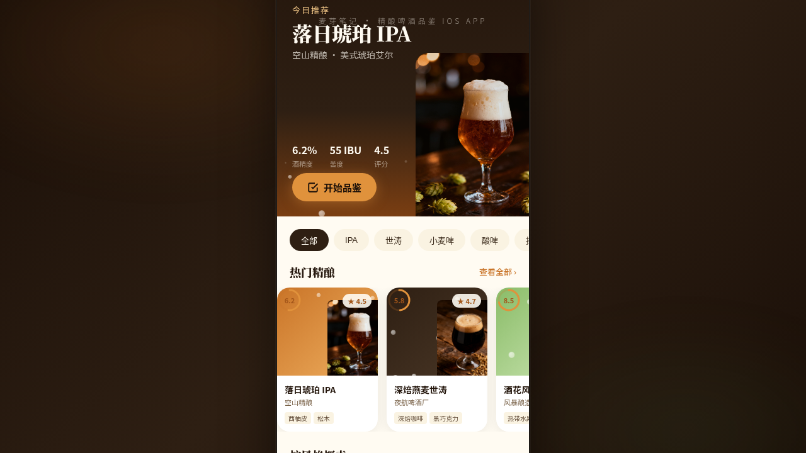

形态：原生 App

# 麦芽笔记 · 精酿啤酒品鉴 iOS App

> 日期：2026-08-18 · 方向：V2 手机 UI · 形态：原生 App · 主题：精酿啤酒品鉴



## 概述

麦芽笔记是一款精酿啤酒品鉴应用，帮助精酿爱好者记录、探索和分享品鉴体验。以琥珀棕、深焙黑、啤酒花绿、泡沫米白为核心配色，传递温暖醇厚的品鉴氛围。

## 目录结构

```
index.html          # 主入口文件（单文件应用，内联 JSX/CSS）
ios-frame.jsx       # iOS 设备边框组件
README.md           # 本文件
设计规范.md          # 详细设计规范
preview.png         # 页面截图
```

## 妙搭在线预览

https://dcniaqwtmoca.feishu.cn/page/SCjYmevYIdJLmsa48drc1Xg1n7f

## 页面结构（共 8 页）

| # | 页面 | 布局特点 | 签名动效 |
|---|------|---------|---------|
| 1 | 首页·发现 | Hero 大图 + 横向滚动卡片 + 风格网格 + 底部 TabBar | 入场序列动画 + 泡沫粒子 + 卡片光泽扫过 |
| 2 | 啤酒详情 | 视差滚动 Hero + 风味雷达 + 吸底操作栏 | 视差滚动 + 雷达图绘制动画 |
| 3 | 品鉴记录 | 时间线列表 + 左滑删除 + 下拉刷新 + 筛选 Chip | 下拉弹性刷新 + 列表入场交错 |
| 4 | 我的酒窖 | 瀑布流/列表切换 + 吸顶 Tab + 搜索框 | 网格瀑布流动态布局 |
| 5 | 个人中心 | 头像统计卡 + 成就徽章横向滚动 + 设置列表 | 环形进度 + 头像脉冲 + 数字计数 |
| 6 | 添加品鉴 | 底部模态弹层 + 星星评分 + 标签云 + 文本区 | 底部滑入 + 星星弹跳 + 标签选中动画 |
| 7 | 设计规范 | 色彩/字体/间距/圆角/动效/组件分区展示 | 分节渐入 |
| 8 | 接口文档 | Tab 分类 + 接口卡片 + 代码示例 + 状态码表 | Tab 切换 + 卡片入场 |

## 原生 App 交互特性

1. **大标题导航栏** - 首页、品鉴、酒窖、个人中心均使用 iOS 风格大标题
2. **底部 TabBar** - 4 个主 Tab（发现/酒窖/记录/我的），选中态有缩放+圆点指示动效
3. **详情页全屏转场** - 点击啤酒卡片 push 到详情页，带滑动过渡动画
4. **底部模态弹层** - 添加品鉴以 Action Sheet 形式从底部滑入
5. **下拉刷新** - 品鉴记录页支持下拉弹性刷新
6. **悬浮操作按钮 FAB** - 右下角浮动 "+" 按钮，带脉冲光圈
7. **左滑删除** - 品鉴记录支持左滑显示删除按钮
8. **吸顶筛选 Tab** - 酒窖页风格标签吸顶固定

## 配色体系

- **主色·琥珀棕** `#C97428` - 精酿啤酒的核心色，温暖有质感
- **深焙黑** `#1A0F08` - 深色背景与主文字，深沉醇厚
- **啤酒花绿** `#6B9B55` - 辅助色，代表酒花与自然
- **泡沫米白** `#FFFBF2` - 浅色背景与留白，清爽柔和

## 动效清单（12+）

1. 页面切换滑动过渡（push/pop）
2. 入场序列动画（stagger 交错）
3. 泡沫粒子上浮
4. 卡片 3D 倾斜
5. 光泽扫过效果
6. 点击涟漪扩散
7. 详情页视差滚动
8. 风味雷达图绘制动画
9. TabBar 图标缩放+圆点
10. FAB 脉冲光圈
11. 星星评分弹跳
12. 下拉弹性刷新
13. 头像脉冲光环
14. 环形进度绘制
15. 数字计数入场
16. 模态底部滑入

## 技术实现

- 单文件 HTML，内联所有 JSX/CSS（符合妙搭平台 Babel 限制）
- React 18 + Babel Standalone 运行时转译
- iOS 设备边框 + 状态栏 + Home Indicator
- 支持 `prefers-reduced-motion` 降级
