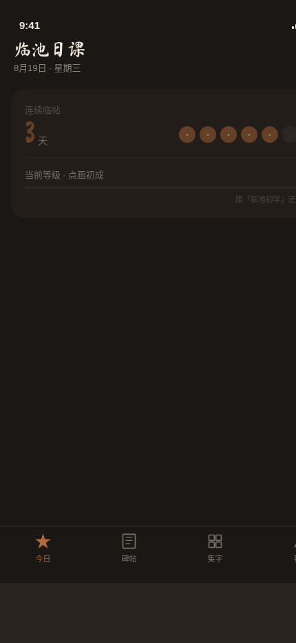

# 临池日课 · 书法临帖原生 App

**类别**：Phone Mock　**日期**：2026-08-19　**形态：原生 App**

## 形态交替说明
上一版（2026-08-19 街角修理铺）为微信小程序，故本版做原生 App 形态，遵循交替规则。

## 主题
书法爱好者的每日临帖 App——每天一个字，写完叠在原帖上看差在哪。

## 简介
核心流程：今日日课（今日一字 + 连续临帖天数 + 等级）→ 选帖（兰亭序/九成宫醴泉铭/多宝塔碑）→ 临写（毛笔画布，笔触粗细随速度变化）→ 叠影对比（透明度滑杆把自己的字与原帖半透明叠合看结构偏差）→ 收入集字墙。9 屏含设计规范页与接口文档页，底部 TabBar + 页面栈 push/pop。

## 截图

## 妙搭预览链接
https://dcniaqwtmoca.feishu.cn/page/ZBW9mU8VcdRToDad93Rc3WITnVb

## 文件说明
- `index.html`：应用入口（React 18 + Babel via 飞书 CDN，外部 jsx 模块化）
- `js/`：组件与页面模块（App.jsx / components/BrushCanvas.jsx / pages/* / data.js / store.js）
- `设计规范.md`：色值/字体/动效系统/产品结构/接口文档
- `preview.png`：430×932 手机截图

## 技术栈
React 18 + Babel standalone（飞书 CDN）+ 模块化 jsx。localStorage 持久化（连续天数/集字墙/等级）。自定义光标开页居中高对比，`prefers-reduced-motion` 降级。**部署版经 http 正常加载；本地须以 http 服务访问（file:// 下 babel fetch 外部 jsx 受限会白屏）**。Browser QA（本地 http 服务）：430×932 / 390×844 渲染正常、9 屏可走通、无 console 严重错误。

## 设计要点
- 反首页模板：home 为「今日一字 + streak + 等级」状态卡，非问候语+搜索+Banner。
- 签名交互：叠影透明度滑杆（拖到 50% 显结构偏差）。
- 碑拓黑底 `#1a1714` + 赭石 `#b06a3b` + 拓白 `#ece5d8` 的拓本气质，禁蓝紫。
- 真实碑帖内容（兰亭序/九成宫/多宝塔各 5 个真实单字配释文），无假功能。
