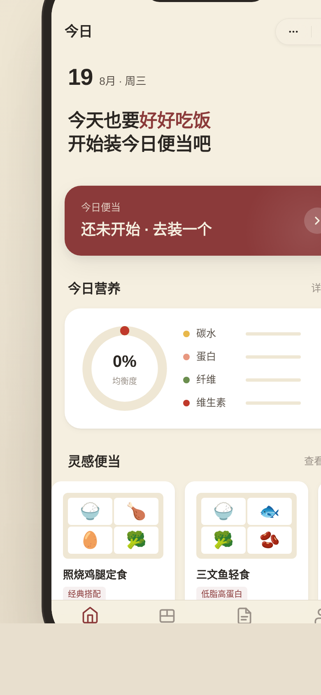

# 便当手帖·微信小程序

形态：微信小程序

> V2 手机 UI · 2026-08-19

## 主题
便当备餐微信小程序——4 格便当盒可视化拼装，营养均衡环实时反馈，存入手帖，周回顾看均衡趋势。

## 简介
把便当盒可视化成 4 格（主食/主菜/配菜/点缀），点食材落入对应格，营养四维环（碳水/蛋白/纤维/维生素）随食材实时计算。4 格装满后盒盖合拢 + 签名动效 + 半屏弹层生成便当卡片，存入今日手帖；周回顾用折线看本周均衡趋势。16 种真实食材，3 个灵感预设一键填入。

形态为微信小程序：底部 TabBar、胶囊导航、半屏弹层、下拉刷新弹性、左滑操作、页面栈转场共 6 种端侧交互。禁用通用首页模板。

## 截图

## 妙搭预览
https://dcniaqwtmoca.feishu.cn/page/VJbGmzOIIdLyizaUkIzcaDRrnXf

## 文件说明
- `index.html` — 单文件源码（HTML + CSS + JS）
- `preview.png` — 手机端截图（390×844，2x）
- `设计规范.md` — 色值 / 字体 / 动效系统 / 端侧交互 / 接口契约

## 技术栈
纯 vanilla 单文件，无 React / Babel / CDN。localStorage 持久化，含设计规范页 + 接口文档页（`/api/mobile/v2/*`）。RAF 随可见性暂停、卸载取消，支持 `prefers-reduced-motion`。

## 自查结论
- ✅ 形态：微信小程序（上次原生 App，本次交替）
- ✅ 完整 User Flow：今日→拼装→营养环→存手帖→周回顾
- ✅ 6 种端侧交互（TabBar/胶囊/半屏/下拉刷新/左滑/页面栈）
- ✅ 4 格便当盒真实拼装 + 营养环正确计算
- ✅ 16 种真实食材，无 Lorem
- ✅ localStorage 存取正常
- ✅ 配色漆木红+食材自然色，禁蓝紫
- ⏳ 等待协调者检查后提交 GitHub
