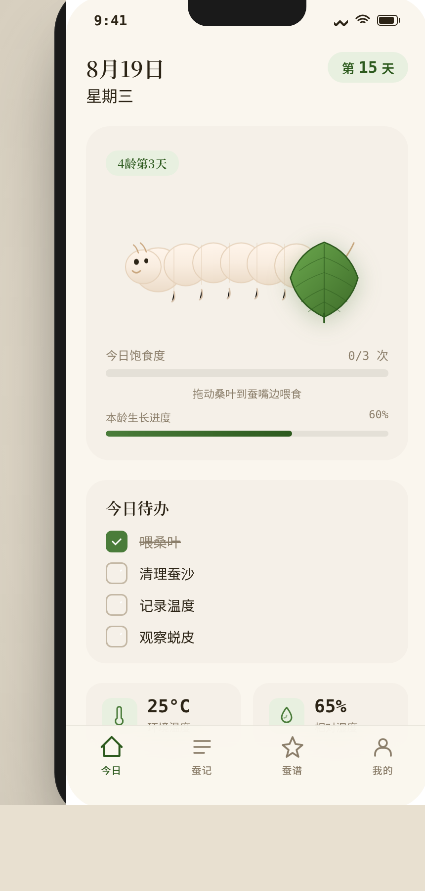

# 养蚕志·桑蚕日记

形态：原生 App

## 简介

一款陪伴家蚕全生命周期饲养的记录工具。以"今日状态 + 任务驱动"为首页，围绕养蚕最高频动作——喂桑叶——设计签名交互：拖动桑叶到蚕嘴边，蚕实时啃食，饱食度上升。覆盖卵→蚁蚕→各龄期→吐丝结茧→化蛹→化蛾的完整生命周期。

产品定位：学生科学观察项目 / 养蚕爱好者的随身饲养手账。

## 截图预览

## 妙搭预览链接

https://dcniaqwtmoca.feishu.cn/page/KJctm4RA8demcJaek65cvZWPnzd

## 页面结构

| 页面 | 说明 |
|------|------|
| 今日 | 蚕体可视化（SVG）+ 拖动桑叶喂食签名交互 + 待办清单 + 环境数据 |
| 蚕记 | 时间线日志（6 条真实养蚕记录）+ 半屏详情弹层 + FAB 写日志 |
| 蚕谱 | 6 个真实家蚕品种卡片 + 搜索过滤 + 品种详情（页面栈 push） |
| 我的 | 饲养统计 + 6 个成就徽章 + 历史批次 + 设置 |
| 设计规范 | 色彩 / 字体 / 动效 / 组件规范展示 |
| 接口文档 | 8 个 Mock API 端点文档 |

## 签名交互

**拖动桑叶喂蚕**：用户拖动桑叶 SVG 到蚕头附近（80px 内），蚕开始啃食——桑叶出现弧形咬痕（clip-path 扩大），蚕体蠕动（scaleY 微变化），6 颗碎屑粒子飞溅，饱食度进度条 +33%。每天可喂 3 次。支持 prefers-reduced-motion 降级为点击喂食。

## 家蚕品种

1. 菁松×皓月 — 白茧，丝质优良，适合初学者
2. 秋丰×白玉 — 白茧，抗逆性强，蚕体健壮
3. 苏菊×明虎 — 黄茧，茧形椭圆，丝色金黄
4. 两广二号 — 亚热带品种，耐高温，适合南方
5. 洞庭×碧波 — 白茧，茧形大，适合教学观察
6. 871×872 — 白茧，茧丝长，适合缫丝实验

## 技术栈

- 纯 vanilla 单文件 HTML（无 React / Babel / CDN 依赖）
- 所有 SVG 内联绘制（蚕体、桑叶、品种示意图、成就徽章）
- localStorage 持久化（喂食状态 / 待办勾选 / 日志条目）
- Noto Serif SC + 系统无衬线 + SF Mono 三字体系统
- 页面可见性监听 + prefers-reduced-motion 降级

## 文件说明

| 文件 | 说明 |
|------|------|
| index.html | 完整应用源码（单文件，110KB） |
| preview.png | 首页截图 |
| 设计规范.md | 色彩 / 字体 / 动效 / 组件规范文档 |

## 设计流水线自查

- [x] Browser QA：0 page error / 0 console error / 0 failed request / 无横向溢出
- [x] Contract Fidelity：FULL（6 页全部实现，签名交互完整）
- [x] Critic：0 CRITICAL / 0 MAJOR / 2 MINOR
- [x] Quality Gate：PASS
- [x] 形态标记：原生 App
- [x] 配色：桑叶绿 + 茧金 + 软米白，无蓝紫渐变，与近期作品不雷同
- [x] 内容：6 个真实家蚕品种、6 条真实日志、真实龄期知识
- [x] 健壮性：localStorage 持久化、visibilitychange 暂停 RAF、prefers-reduced-motion 降级

等待协调者检查后提交 GitHub。
