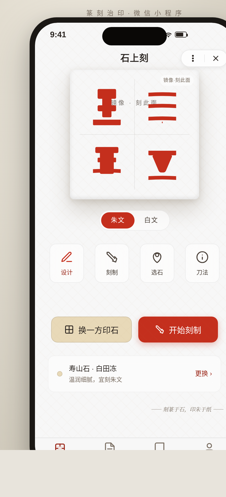
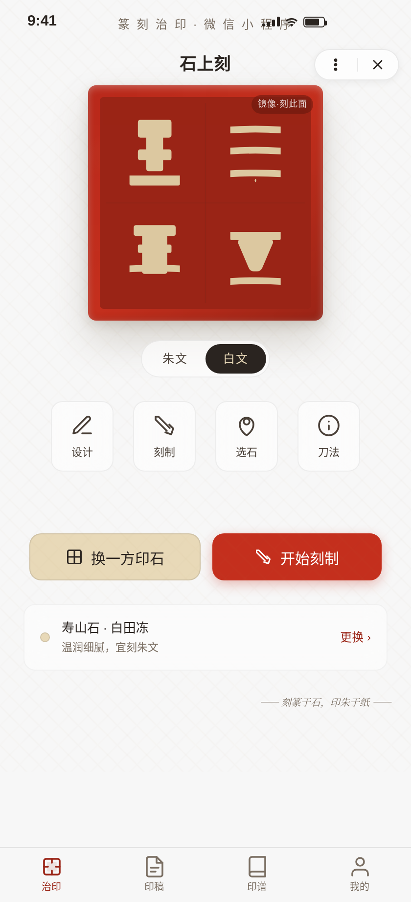
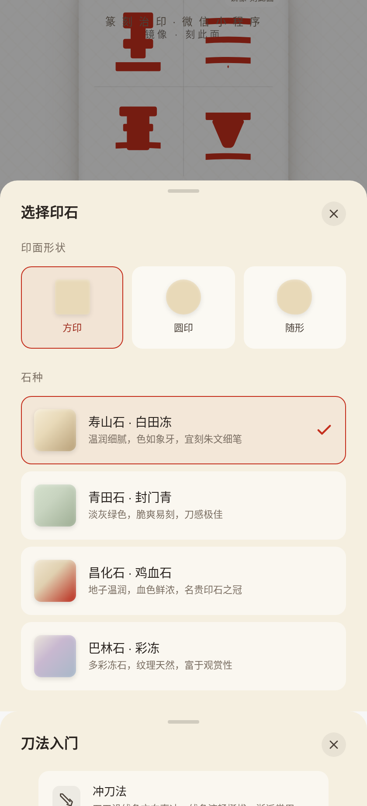
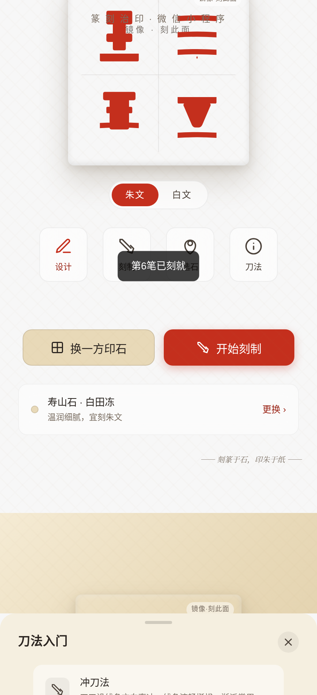
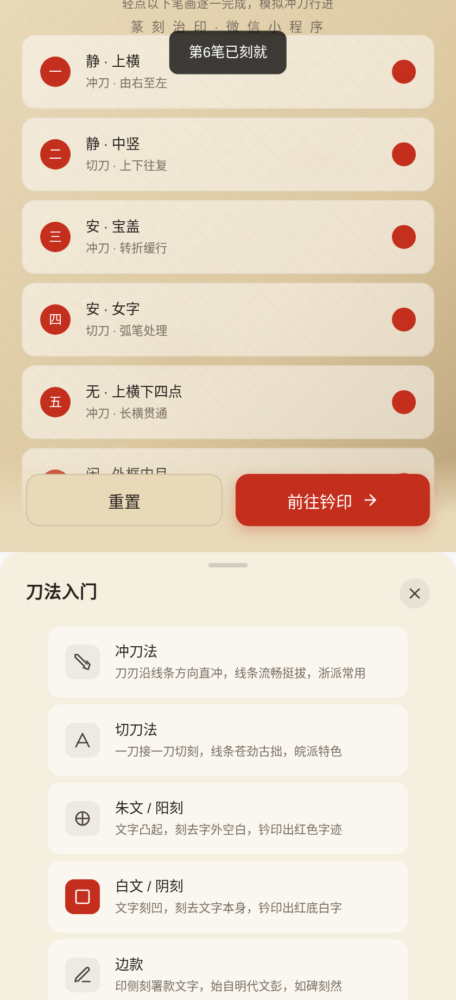
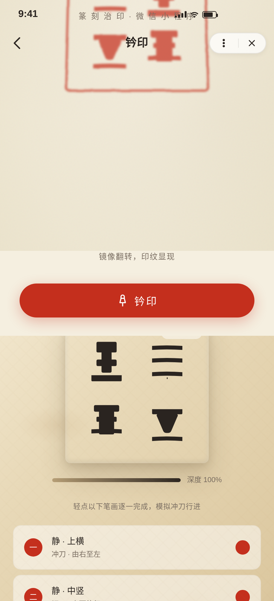

# 石上刻 · 篆刻治印工作台

形态：微信小程序
日期：2026-08-19
类别：Phone Mock (V2)

## 主题

篆刻治印。一款陪伴治印全流程的微信小程序——从选石、设计印稿、逐笔刻制，到钤印验证、归档印谱。

## 简介

整个界面是一方正在被治印的印石工作台。核心认知是篆刻最反直觉的动作：**你刻的是反字，印出来才是正字**。

- 工作台首屏即「石面」：印稿设计区始终以**镜像（反字）**呈现，角标注明「镜像·刻此面」，所见即所刻。
- 朱文（阳刻）/ 白文（阴刻）一键切换，石面与印面同步表现阴阳。
- 刻制页逐笔标记完成，深度进度由 0% 递进至 100%；未刻完不可前往钤印（守卫）。
- **Signature Moment**：钤印页按下「钤印」→ 印石 `rotateX(180°)` 翻转 → 镜像反字翻为正字 → 朱砂印纹在宣纸上由中心向外晕开定形 → 归档至印谱。

视觉来源是印石、刻刀、朱砂印泥与宣纸钤印的真实物质：寿山石暖象牙赭黄为底、青田石淡灰绿为辅、朱砂红仅作印纹与主操作强调，墨黑为文字。

## 截图

**工作台首屏（镜像印稿 · 朱白切换）**


**白文（阴刻）切换**


**选石半屏弹层（方/圆/随形 × 寿山/青田/昌化/巴林）**


**刻制完成（逐笔标记 · 深度 100%）**


**钤印页（翻转前 · 镜像石面）**


**钤印翻转显正（Signature Moment · 正字朱文晕开）**


## 妙搭预览

在线预览链接：https://dcniaqwtmoca.feishu.cn/page/QXMKmZghLdzxLGaxM6McShgsnDP

## 完整 User Flow

```
治印(工作台: 镜像印稿 + 朱白切换)
  ├─ 选石(半屏弹层: 印面形状 方/圆/随形 × 石种 寿山/青田/昌化/巴林)
  ├─ 刀法(半屏弹层: 冲刀/切刀/朱白文/边款 科普)
  └─ 开始刻制 → 刻制页(6笔逐一标记 + 深度进度 0→100%)
        └─ 前往钤印(守卫: 未刻完拦截) → 钤印页
              └─ 钤印(翻转180°显正像 + 印纹晕开) → 归档印谱(6方 + 左滑分享/删除)
```

底部 TabBar：治印 / 印稿(4件草稿+新建) / 印谱(6方+左滑) / 我的(石庵学人·治印统计)。

## 微信小程序端侧交互（6 种）

1. 胶囊按钮（··· ×）+ 自定义导航栏（返回/标题）
2. 页面栈 push/pop 转场 + 左边缘滑动返回
3. 底部 TabBar（治印/印稿/印谱/我的）
4. 半屏弹层 Bottom Sheet（选石/刀法）+ 遮罩点击关闭
5. 下拉刷新（印泥晕开动效）
6. 左滑操作（印谱条目展开分享/删除）

## 文件说明

- `index.html` — 单文件应用（HTML + CSS + vanilla JS，零外部依赖）
- `设计规范.md` — 配色/字体/动效/空间系统
- `preview.png` — 工作台首屏主截图
- `preview_*.png` — 各状态截图（白文/选石/刻制完成/钤印/翻转）

## 技术栈

- 纯 vanilla HTML/CSS/JS，单文件，无 React/Babel/CDN
- 篆字字形：SVG path 手描写形（静/安/无/闲/真/乐）
- SVG 滤镜 `feTurbulence`+`feDisplacementMap` 模拟印泥毛边粗糙感
- CSS `rotateX(180deg)` + `@keyframes` 实现钤印翻转与印纹晕开
- 健壮性：支持 `prefers-reduced-motion` 降级；RAF/定时器随 `visibilitychange` 暂停且卸载取消；快速操作不叠加定时器
- 手机壳约 390×844，壳克制，重点在屏幕内

## 自查结论

- 删动画成立（石面镜像/朱白/刻制进度/印谱归档均为静态可读结构）✓
- 灰度下层级成立（墨黑文字/石底/朱砂强调三级对比）✓
- 轮廓与近期作品可区分（工作台仪器式 + 镜像机制，非日志/档案型）✓
- Browser QA：零 Console Error、零失败请求、无横向溢出、截图均非空白 ✓
- 完整流程实测走通：选石→朱白→刻制(深度 0→100%)→守卫→钤印翻转→归档印谱 ✓
- 4 Tab 均有真实内容，无空壳/假功能 ✓

> 等待协调者检查后提交 GitHub。
