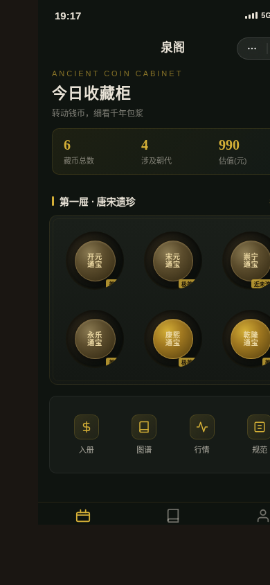

形态：微信小程序

# 泉阁 · 古钱币鉴赏柜 · V2 手机 UI

> 一款古钱币鉴赏柜微信小程序。转动钱币，细看千年包浆——识读钱文 → 转动看包浆光泽 → 判品相 → 按朝代材质入册 → 图谱速查 → 行情参考。

## 🎨 主题

古钱币鉴赏（钱币学 / numismatics）。每枚古钱的包浆独一无二，转出不同的光泽流。整个小程序围绕"随身速查 + 把玩鉴赏"展开，从识读到入册，在转动那刻获得包浆流转的满足。

## 📱 形态

微信小程序。端侧交互 6 种：胶囊按钮 + 自定义导航栏、底部 3 TabBar、半屏弹层 / ActionSheet、页面栈 push/pop 转场、下拉刷新弹性、左滑操作。

## ✨ 签名动效

**转动包浆**——点击钱币进入半屏详情，拖动旋转钱币，包浆光泽（铜绿 / 银白 / 铁锈 / 鎏金）随旋转角度流动交替显现，像在掌心转动一枚真钱对着光看。每枚钱币有独立包浆色组，转出不同的光泽分布。支持 `prefers-reduced-motion` 降级。

## 🔁 完整 User Flow

鉴赏柜首页（今日收藏柜·分屉网格）→ 点钱币半屏详情（正反 / 钱文 / 朝代 / 材质 / 品相 / 包浆）→ 转动看包浆签名 → 入册登记（选朝代 / 材质 / 品相 / 备注）→ 图谱速查（朝代年表 / 钱文识读）→ 行情参考。全程因果跳转无死路。

## 🪙 真实内容

6 种古钱：开元通宝（唐）/ 宋元通宝（北宋）/ 崇宁通宝（北宋徽宗瘦金体）/ 永乐通宝（明）/ 康熙通宝（清）/ 乾隆通宝（清）。品相术语：美品 / 极美品 / 近未流通。材质：青铜 / 铁 / 银 / 黄铜。朝代年表：唐宋元明清。每枚含独立包浆描述与色组。

## 🎨 配色

金属包浆系：展托墨绿 `#0f1410` + 鎏金 `#d4af37` + 牙白素绢 `#e8e2d6` + 铜绿锈 `#4a7c59` + 铁锈红 `#e06555` + 银白泽 `#c0c0c8`。无蓝紫渐变，与近期暖纸墨朱砂木质作品完全错开。

## 📁 文件说明

| 文件 | 说明 |
|------|------|
| `index.html` | 单文件应用源码（纯 vanilla，含全部页面与逻辑） |
| `preview.png` | 390px 视口截图 |
| `设计规范.md` | 色彩 / 字体 / 动效 / 端侧交互 / 内容规范 |

## 🔧 技术栈

- 纯 vanilla 单文件 HTML（无 React / Babel / 外部 CDN）
- canvas 2D 实现包浆光泽旋转（`drawPatina(angle)`）
- localStorage 持久化鉴赏柜
- 390px 目标宽度 + 414px 邻近尺寸自检
- 健壮性：RAF/定时器随可见性暂停且卸载取消，支持 prefers-reduced-motion

## 🌐 妙搭在线预览

https://dcniaqwtmoca.feishu.cn/page/XShXmLAdpd3t7dasUnucauJYnBd

## 📝 自查结论

- Browser QA：零 Console 错误、零页面错误、390px/414px 均无横向溢出、点击钱币半屏详情正常、转动包浆 canvas 真实工作、6 枚钱币全部渲染
- Contract Fidelity：FULL（core_idea / must_keep / 签名动效 / 真实内容 / localStorage / 规范+接口页全部实现）
- Critic：0 CRITICAL、0 MAJOR
- Quality Gate：PASS
- 反模板：首屏=今日收藏柜分屉结构，非问候+搜索+Banner 模板；签名 rotate-patina-sheen 近 30 版首现；金属包浆材质近 20 版首现
