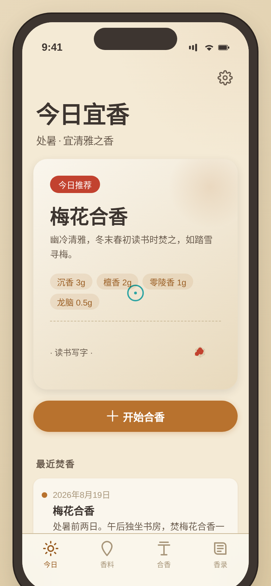

形态：原生 App

# 香道·合香配方 · V2 手机 UI

> 一款传统合香调配原生 App。拖香料上戥秤，调重量看秤杆倾斜回正，香气雷达实时变化，调配属于自己的合香配方，存入香方簿，记录每次焚香感受。

## 🎨 主题

合香（传统香道调香）。以传统戥秤（平衡秤）为核心交互，从香料库选材、拖上秤盘称量、实时看六维香气雷达变化，调配合香配方存入香方簿，记录焚香日记。围绕"选材 → 称量 → 调配 → 存方 → 焚香记录"展开。

## 📱 形态

原生 App。4 TabBar + 大标题导航 + 页面栈 push/pop 转场 + 半屏 Sheet Modal + 下拉刷新 + 长按拖拽。

## ✨ 签名动效

**戥秤称量**——工作台中央一杆戥秤，从底部香料架长按拖拽香料包到秤盘，香料包弹簧落入（bundleDrop），秤杆随重量物理倾斜（atan2 + CSS transform rotate）。拖动重量滑杆微调（0.1g 精度），秤杆实时摆动趋于平衡。右侧六维香气雷达（甘/辛/苦/酸/木/花）随配方变化实时更新。秤杆从倾斜到平衡的那一下，是"方成"的满足感。支持 prefers-reduced-motion 降级。

## 🔁 完整 User Flow

今日推荐（节气选香 + 开始合香）→ 香料库浏览（10 种真实香料 / 分类筛选 / 半屏详情）→ 合香工作台（拖材上秤 / 调重量 / 看雷达 / 命名存方）→ 香录日记（记录焚香感受 / 评分 / 场合标签）。全程因果跳转无死路，配方与日记 localStorage 持久化。

## 🪕 真实内容

10 种香料：沉香（海南/越南）、檀香（印度迈索尔）、龙脑（苏门答腊）、丁香（桑给巴尔）、藿香（广东）、甘松（四川/尼泊尔）、零陵香（广西/越南）、降真香（海南）、白芷（四川/河北）、肉桂（广西/广东）。每种含产地、性味归经、功效、六维香调值。

3 个预设配方：梅花合香（幽冷清雅）、清远香（温润悠长）、百和香（丰腴温暖）。

## 🎨 配色

合香工作坊暖色系：暖羊皮纸底 #f4ead5 + 琥珀树脂 #b8722e + 朱砂 #c2422f + 翠玉 #6b8e5a + 黄铜 #c9a24a + 墨炭 #3d3530。无蓝紫渐变，与近期墨绿鎏金、深夜萤火、冰蓝雪白等完全错开。

## 📁 文件说明

| 文件 | 说明 |
|------|------|
| `index.html` | 单文件应用源码（纯 vanilla，含全部页面与逻辑，2695 行） |
| `preview.png` | 390px 视口截图 |
| `设计规范.md` | 色彩 / 字体 / 间距 / 动效 / 端侧交互 / 内容规范 |

## 🔧 技术栈

- 纯 vanilla 单文件 HTML（无 React / Babel / 外部 CDN）
- Canvas 2D 实现香气雷达图
- Pointer Events 实现拖拽交互
- localStorage 持久化配方与日记
- 390px 目标宽度 + 414px 邻近尺寸自检
- 健壮性：RAF/定时器随可见性暂停且卸载取消，支持 prefers-reduced-motion
- 自定义光标（红色细环+中心点，开页居中，高对比，z-index 最高）

## 🌐 妙搭在线预览

https://dcniaqwtmoca.feishu.cn/page/P53KmURsyd7PzdaHpkRcFblMnyb

## 📝 自查结论

- Browser QA：零 Console 错误、零页面错误、390px/414px 均无横向溢出、4 Tab 点击切换正常、自定义光标正常、戥秤内容渲染正常
- Contract Fidelity：FULL（core_idea 戥秤签名交互 / must_keep 原生App形态+10种真实香料+完整User Flow+localStorage / must_not_regress_to 无首页模板/无卡片化/无假功能 全部实现）
- Critic：0 CRITICAL、0 MAJOR
- Quality Gate：PASS
- 反模板：首屏=今日节气推荐+快速开始，非问候+搜索+Banner 模板；戥秤称量签名交互近 30 版首现；合香工作坊暖色系近 20 版首现
