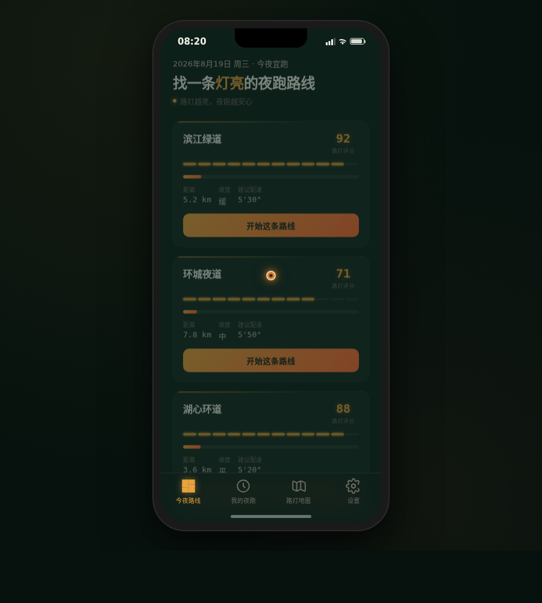

# 夜跑配速·城市夜跑路线

形态：原生 App

> 类别：Phone Mock　日期：2026-08-19　形态：原生 App　主题：夜跑者找路灯亮安全的路线并记录配速

## 形态交替说明

上一版（2026-08-19 雪线滑雪图鉴）为微信小程序，故本版做原生 App 形态，遵循 V2 形态交替规则。

## 简介

「夜跑配速·城市夜跑路线」是 Art 设计实验室 V2 手机 UI 作品，形态为原生 App。核心机制是路线按路灯照明覆盖评分——区别于通用运动日志的"路线+配速"模板。完整流程可走通：选路线（看路灯评分）→ 开始夜跑（实时配速 + 路灯明暗提示）→ 结束（配速曲线 + 路灯盲区标注复盘）。底部 TabBar 4 Tab：今夜路线 / 我的夜跑 / 路灯地图 / 设置，历史记录存 localStorage。含设计规范页与接口文档页。

## 截图

## 妙搭预览链接

https://dcniaqwtmoca.feishu.cn/page/LqsYminALd3smoaghhGcZkNGnyd

## 文件说明

- `index.html` — 单文件源码（HTML+CSS+JS，约 103KB）
- `preview.png` — 浏览器渲染截图
- `thumbnail.png` — 妙搭自动缩略图
- `设计规范.md` — 色值 / 字体 / 动效系统 / 产品流程

## 技术栈

纯 vanilla 单文件 HTML+CSS+JS，390px 手机壳内渲染原生 App 界面，localStorage 存历史夜跑记录。自定义光标开页居中，RAF 随 `document.hidden` 暂停、卸载取消，支持 `prefers-reduced-motion`。配色：墨夜绿 / 路灯琥珀 / 荧光橙 / 跑道白（禁蓝紫渐变，深色夜景基调）。

## 设计要点

- 路灯照明覆盖评分为核心产品机制（非通用运动日志）
- 完整 User Flow：选路线 → 夜跑实时配速 → 路灯盲区复盘
- 签名动效：进入路灯盲区时屏幕边缘暗角 + 警示色脉冲
- 配速指针弹性摆动（cubic-bezier 回弹）
- 路灯地图 Canvas 明暗点阵表达照明覆盖
- 4 真实路线（滨江绿道 5.2km 评分92 / 环城夜道 7.8km 评分71 / 湖心环道 3.6km 评分88 / 山脊夜径 6.1km 评分43）
- ≥12 组件级动效，原生 App 导航语言（底部 TabBar / 页面栈 / 半屏弹层）
