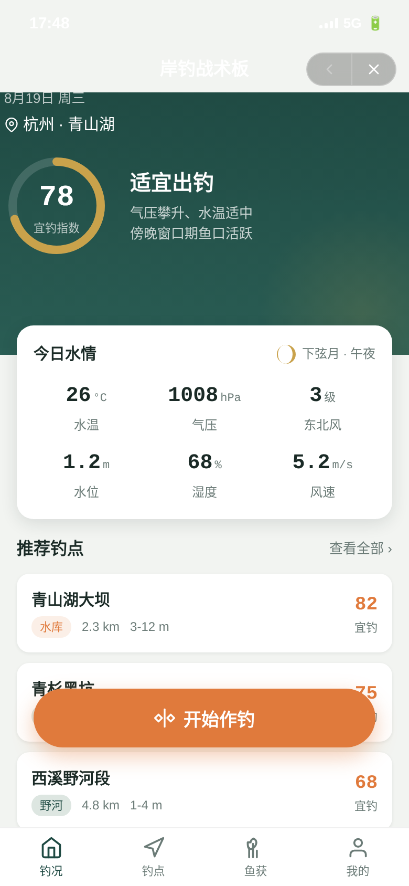
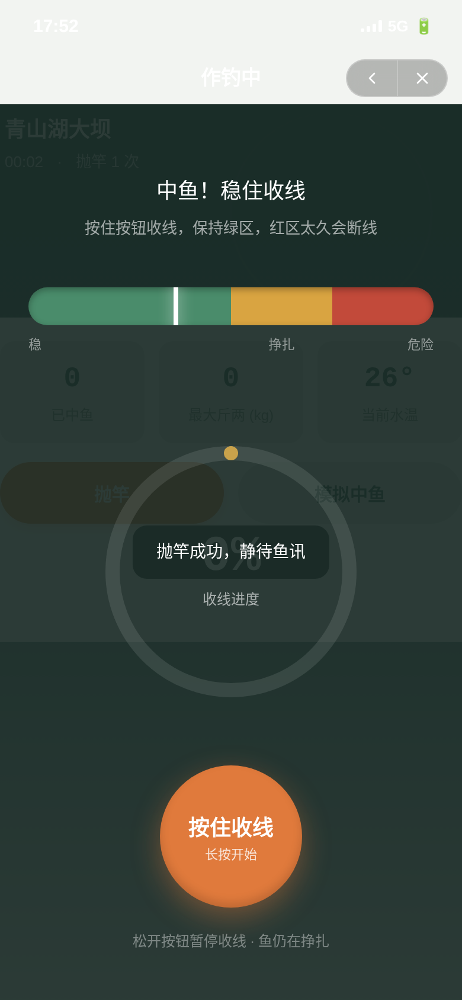
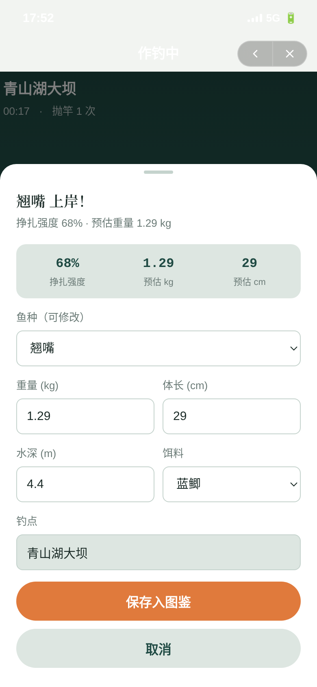
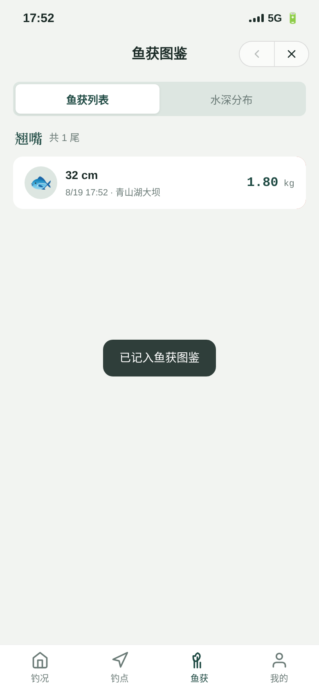
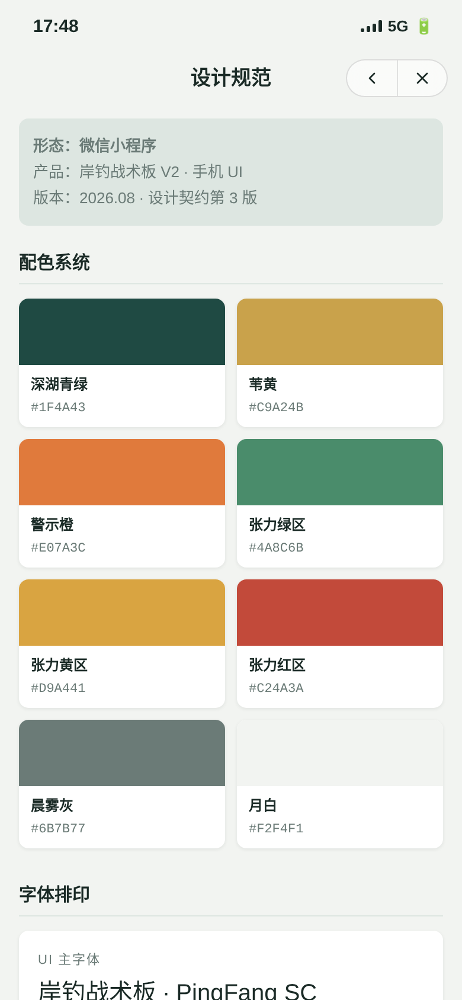

# 岸钓战术板 · 鱼获日志（微信小程序）

形态：微信小程序

岸钓者的随身战术板与鱼获日志微信小程序单文件 mock。出门前看水情月相定宜钓、选钓点；作钓时把"中鱼起鱼"这一情绪高点变成可触发的张力手势，并自动沉淀鱼获数据入图鉴。

## 妙搭在线预览

https://dcniaqwtmoca.feishu.cn/page/KTgjm6QAJd32BPaOgLMcPxq5nFd

（本地预览：浏览器直接打开 `index.html`）

## 截图展示

### 钓况首页（水情战术板）


### 收线签名动效（中鱼·张力绿/黄/红区）


### 鱼获登记半屏（挣扎强度自动带入）


### 鱼获图鉴（保存后可见）


### 设计规范页


## 完整 User Flow

钓况首页 → 点「开始作钓」→ 选钓点（半屏弹层）→ 作钓中页（抛竿计时）→ 模拟中鱼 → 收线张力（签名动效）→ 鱼跃出水面 → 鱼获登记半屏 → 保存入图鉴 → 鱼获页可见。

全程因果跳转，无死链。已端到端验证：脉冲收线到 100% → 鱼跃 → 登记半屏带出挣扎强度与预估重量 → 填写保存 → localStorage 记录数 +1 → 鱼获图鉴出现该尾鱼。

## 端侧交互（≥4 种，真实工作）

1. **胶囊导航栏**（右上返回 + 关闭）：页面栈 push 后返回按钮激活，点击 pop 回退
2. **底部 TabBar**：钓况 / 钓点 / 鱼获 / 我的，四 Tab 切换
3. **半屏弹层**：钓点详情 / 选钓点 / 鱼获登记，带蒙层与弹簧上升
4. **下拉刷新弹性**：钓况首页下拉回弹刷新
5. **左滑操作**：鱼获列表项左滑露出删除
6. **页面栈 push/pop 转场**：作钓中 / 设计规范 / 接口文档从右侧滑入滑出

## 签名动效：收线张力

- 张力条分绿（稳）/黄（挣扎）/红（断线风险）三区，RAF 驱动正弦波 + 随机噪声模拟鱼挣扎
- 按住"收线"推进进度（约 12%/s），同时张力上升；松开张力回落
- 红区累计 >2 秒 → 断线重来（提示"鱼跑了，换个子线再来"）
- 进度到 100% → 鱼跃出水面 → 鱼获登记半屏自动带出挣扎强度与预估重量
- 挣扎强度（maxStruggle）与预估重量联动：挣扎越强预估越重

## 内容真实度

- **6 种本土淡水鱼**：鲫鱼、鲤鱼、草鱼、鲶鱼、翘嘴、鳊鱼（各带习性 / 常见重量 / 栖息水层）
- **4 个真实钓点**：青山湖大坝（水库）、西溪野河段（野河）、青杉黑坑（黑坑）、钱塘江北岸（江岸）
- **真实水情参数**：水温 / 气压 / 风向风速 / 月相 / 水位 / 湿度
- **饵料库**：蓝鲫、九一八、速攻、红虫、蚯蚓、玉米粒、泥鳅、面饵

## 文件说明

```
2026-08-19_岸钓战术板_angling-tactical-board/
├── index.html          单文件应用（纯 vanilla，无外部依赖）
├── 设计规范.md         配色/字体/动效/端侧交互/签名交互（取自源码真实值）
├── README.md           本文件
├── preview.png         首页截图
├── thumbnail.png       缩略图
└── preview/            关键页面截图
    ├── home.png
    ├── reel.png
    ├── catch-form.png
    ├── catches.png
    └── design-spec.png
```

## 技术栈

纯 vanilla 单文件 HTML + CSS + JS。无 React / Babel / CDN 外部依赖。localStorage 持久化（`atb_catches` / `atb_settings` / `atb_session`）。

## 健壮性红线

- 零未定义引用，DOM 查询有 null 守卫
- RAF 驱动收线动画，`document.hidden` 时暂停、卸载取消
- 定时器 `clearInterval` 清理，快速操作不叠加（`clearTimeout` 重置 / `setInterval` 单例）
- 高频指针事件直接操作 DOM style，不触发重渲染
- 支持 `prefers-reduced-motion` 降级（收线退化为静态按钮 + 指示器）
- 390px 目标宽度，414px 不溢出；所有路径相对路径

## 设计规范页 + 接口文档页

入口在「我的 → 设计规范 / 接口文档」。

- 设计规范：8 色色值、3 套字体、7 项动效、签名交互说明、形态标记
- 接口文档：localStorage 三 key 数据结构、方法接口表、事件系统

## 自查结论（Orchestrator 流水线）

- 形态：微信小程序（上一次 phone_mock「养蚕志」为原生 App，本版交替为微信小程序）✅
- Browser QA：PASS（页面加载正常、零 Console/Page Error、390/414 无横向溢出、5+ 交互全部通过、截图非空白）✅
- Critic · Contract Fidelity：FULL（must_keep 5 条全部满足、must_not_regress_to 3 条全部规避、核心流程端到端走到结果并持久化）✅
- 签名动效：收线张力真实可玩，起鱼与断线两结果均成立，挣扎强度→预估重量联动 ✅
- 已知 MINOR：首页"开始作钓"主操作按钮（拇指区吸底）部分遮挡推荐钓点列表第二条卡片信息——可在「钓点」Tab 完整查看，不影响核心流程，记录待优化
- Quality Gate：PASS（CRITICAL=0，Phone 门槛全部达到）
- 等待协调者检查后提交 GitHub（本任务未执行 git add/commit/push）
